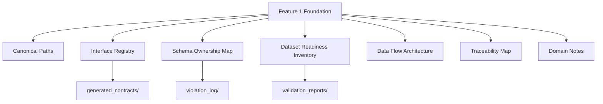
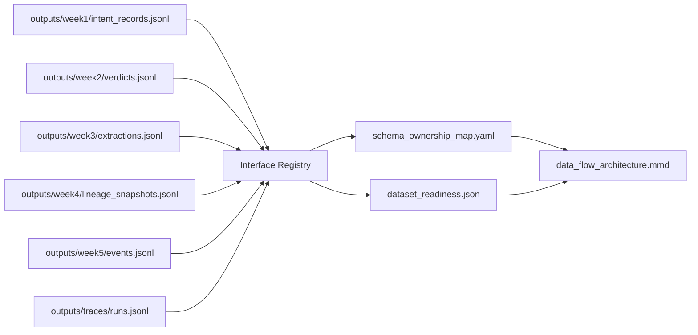
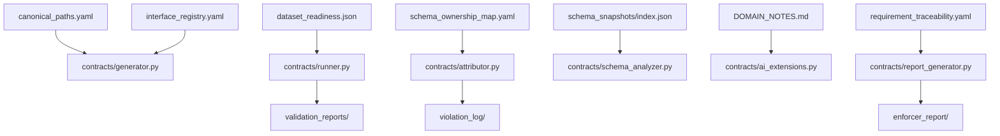

# Implementation Plan: Platform Foundation and Canonical Data Surface

**Branch**: `001-platform-data-surface` | **Date**: 2026-04-01 | **Spec**: [spec.md](./spec.md)
**Input**: Feature specification from `/specs/001-platform-data-surface/spec.md`

**Note**: This template is filled in by the `/speckit.plan` command. See `.specify/templates/plan-template.md` for the execution workflow.

## Summary

Establish a production-grade Python foundation for The Data Contract Enforcer by
locking canonical repository paths, defining machine-readable source-of-truth
artifacts, and documenting governed dataset/interface ownership boundaries. This
feature delivers reusable metadata and architecture assets that later features
(contract generation, validation, attribution, schema analysis, AI checks,
reporting) consume directly without redefining paths or semantics.

## Technical Context

<!--
  ACTION REQUIRED: Replace the content in this section with the technical details
  for the project. The structure here is presented in advisory capacity to guide
  the iteration process.
-->

**Language/Version**: Python 3.11+
**Primary Dependencies**: `pydantic` (typed models), `PyYAML` (YAML metadata),
standard library (`pathlib`, `json`, `typing`, `dataclasses` optional)
**Storage**: File-based JSON/YAML/Markdown/Mermaid assets in repository
**Testing**: `pytest` (unit + integration checks for path/readiness validators)
**Target Platform**: Cross-platform CLI execution (Windows/Linux/macOS),
evaluator-runnable from repo root
**Project Type**: Python CLI/library foundation with metadata contracts
**Performance Goals**: Foundation validation run completes in <5 seconds for
current six-dataset surface; path checks are O(n) over registered assets
**Constraints**: Canonical paths immutable after foundation acceptance unless
versioned migration is documented; no fabricated operational evidence
**Scale/Scope**: Week 7 baseline with 6 governed datasets, authoritative
interface registry, and 7 foundational source-of-truth artifacts

## Planned Feature 1 Artifacts (Proposed Files + Formats)

| Artifact                          | Proposed File                             | Format                        |
| --------------------------------- | ----------------------------------------- | ----------------------------- |
| Canonical path inventory          | `contracts/canonical_paths.yaml`          | YAML                          |
| Dataset readiness inventory       | `contracts/dataset_readiness.json`        | JSON                          |
| Interface registry                | `contracts/interface_registry.yaml`       | YAML                          |
| Schema ownership map              | `contracts/schema_ownership_map.yaml`     | YAML                          |
| Data flow architecture source     | `contracts/data_flow_architecture.mmd`    | Mermaid                       |
| Requirement traceability map      | `contracts/requirement_traceability.yaml` | YAML                          |
| Foundational domain/schema notes  | `DOMAIN_NOTES.md`                         | Markdown                      |
| Architecture explainer            | `contracts/architecture.md`               | Markdown + Mermaid references |
| Canonical schema snapshots index  | `schema_snapshots/index.json`             | JSON                          |
| Validation readiness output index | `validation_reports/readiness_index.json` | JSON                          |
| Mismatch/violation index          | `violation_log/mismatch_index.json`       | JSON                          |
| Foundation executive report       | `enforcer_report/foundation_report.md`    | Markdown                      |

## Canonical Target Paths (Authoritative)

This feature treats the following as immutable canonical targets for downstream
features:

- `contracts/generator.py`
- `contracts/runner.py`
- `contracts/attributor.py`
- `contracts/schema_analyzer.py`
- `contracts/ai_extensions.py`
- `contracts/report_generator.py`
- `generated_contracts/`
- `validation_reports/`
- `violation_log/`
- `schema_snapshots/`
- `enforcer_report/`
- `outputs/week1/intent_records.jsonl`
- `outputs/week2/verdicts.jsonl`
- `outputs/week3/extractions.jsonl`
- `outputs/week4/lineage_snapshots.jsonl`
- `outputs/week5/events.jsonl`
- `outputs/traces/runs.jsonl`
- `DOMAIN_NOTES.md`
- `README.md`

## Constitution Check

_GATE: Must pass before Phase 0 research. Re-check after Phase 1 design._

- [x] Spec-first gate: Active spec exists and defines behavior, boundaries, and
      acceptance scenarios before implementation work.
- [x] Canonical structure gate: Plan preserves required canonical repository
      layout and authoritative target paths.
- [x] Compounding design gate: Deliverables are reusable source-of-truth assets
      consumed directly by later features.
- [x] Data contract gate: Schemas, lineage, validation outputs, and violations
      are planned as first-class assets in stable locations.
- [x] Evidence gate: Plan captures mismatch evidence and readiness states without
      rewriting canonical semantics.
- [x] Python production gate: Typed models, deterministic paths, and
      reproducible CLI entry points are defined.
- [x] Downstream impact gate: Ownership/consumer context and migration impact are
      modeled explicitly.
- [x] Operability gate: Artifacts include plain-language reporting outputs.
- [x] Prompt architecture gate: Plan extends approved specs and enduring platform
      architecture.

Post-Design Re-check (Phase 1): PASS. `research.md`, `data-model.md`,
`contracts/*`, and `quickstart.md` maintain all constitutional requirements.

## Project Structure

### Documentation (this feature)

```text
specs/[###-feature]/
├── plan.md              # This file (/speckit.plan command output)
├── research.md          # Phase 0 output (/speckit.plan command)
├── data-model.md        # Phase 1 output (/speckit.plan command)
├── quickstart.md        # Phase 1 output (/speckit.plan command)
├── contracts/           # Phase 1 output (/speckit.plan command)
└── tasks.md             # Phase 2 output (/speckit.tasks command - NOT created by /speckit.plan)
```

### Source Code (repository root)

<!--
  ACTION REQUIRED: Replace the placeholder tree below with the concrete layout
  for this feature. Delete unused options and expand the chosen structure with
  real paths (e.g., apps/admin, packages/something). The delivered plan must
  not include Option labels.
-->

```text
contracts/
├── generator.py
├── runner.py
├── attributor.py
├── schema_analyzer.py
├── ai_extensions.py
├── report_generator.py
├── canonical_paths.yaml
├── dataset_readiness.json
├── interface_registry.yaml
├── schema_ownership_map.yaml
├── requirement_traceability.yaml
├── data_flow_architecture.mmd
└── architecture.md

generated_contracts/
validation_reports/
violation_log/
schema_snapshots/
enforcer_report/

outputs/
├── week1/intent_records.jsonl
├── week2/verdicts.jsonl
├── week3/extractions.jsonl
├── week4/lineage_snapshots.jsonl
├── week5/events.jsonl
└── traces/runs.jsonl

src/
├── cli/
│   └── foundation.py
├── validators/
│   ├── path_validator.py
│   └── readiness_validator.py
└── models/
      ├── registry_models.py
      └── readiness_models.py

tests/
├── contract/
├── integration/
└── unit/
```

**Structure Decision**: Use canonical root-level layout from requirements, with
Python implementation modules under `src/` and machine-readable source-of-truth
artifacts in `contracts/`. No path deviations accepted in Feature 1.

## Validation Approach

### Path Validation

- Validate required files/directories exist for all canonical target paths.
- Validate path-case and normalized separators to prevent platform drift.
- Validate artifact references point to canonical paths only.
- Emit structured output to `validation_reports/readiness_index.json`.

### Dataset Readiness Validation

- For each governed dataset path, evaluate: - existence/accessibility, - parseability (JSONL line validity), - minimum canonical field-set alignment, - semantic mismatch flags, - readiness state enum (`confirmed_from_repository_evidence`,
  `inferred_from_requirement_document`, `blocked_by_missing_upstream_data`,
  `pending_migration_or_normalization`).
- Record mismatches in `violation_log/mismatch_index.json` and migration needs in
  `DOMAIN_NOTES.md`.

## Dependency Flow to Later Features

- Feature 2 (contract generation): consumes canonical paths + interface registry
- Feature 3 (validation runtime): consumes readiness inventory + schema ownership
- Feature 4 (violation attribution): consumes ownership map + mismatch evidence
- Feature 5 (schema evolution analysis): consumes schema snapshots + traceability
- Feature 6 (AI-specific checks): consumes interface semantics + schema notes
- Feature 7 (report generation): consumes readiness/violation outputs + notes

## Risks & Mitigations

| Risk                                            | Impact                        | Mitigation                                                                                            |
| ----------------------------------------------- | ----------------------------- | ----------------------------------------------------------------------------------------------------- |
| Upstream datasets missing or renamed            | Blocks readiness confirmation | Track as `blocked_by_missing_upstream_data`; keep canonical target unchanged; document migration path |
| Interface inventory incomplete in requirements  | Boundary ambiguity            | Mark inferred interfaces explicitly; require follow-up validation before downstream implementation    |
| Semantic mismatch hidden by naive field mapping | Contract drift                | Prohibit silent rewrites; create explicit mismatch records with business-meaning notes                |
| Canonical path drift across features            | Rework and invalid traces     | Enforce path validator in CI and reference only canonical inventory                                   |
| Over-coupled artifact schemas                   | Hard to evolve                | Version metadata schemas and maintain backward-compatible fields                                      |

## Mermaid Diagrams

### 1) Platform Foundation Architecture



### 2) Governed Data Surface and Interface Flow



### 3) Artifact Dependency Flow into Later Capabilities



## Complexity Tracking

> **Fill ONLY if Constitution Check has violations that must be justified**

| Violation | Why Needed | Simpler Alternative Rejected Because |
| --------- | ---------- | ------------------------------------ |
| None      | N/A        | N/A                                  |
