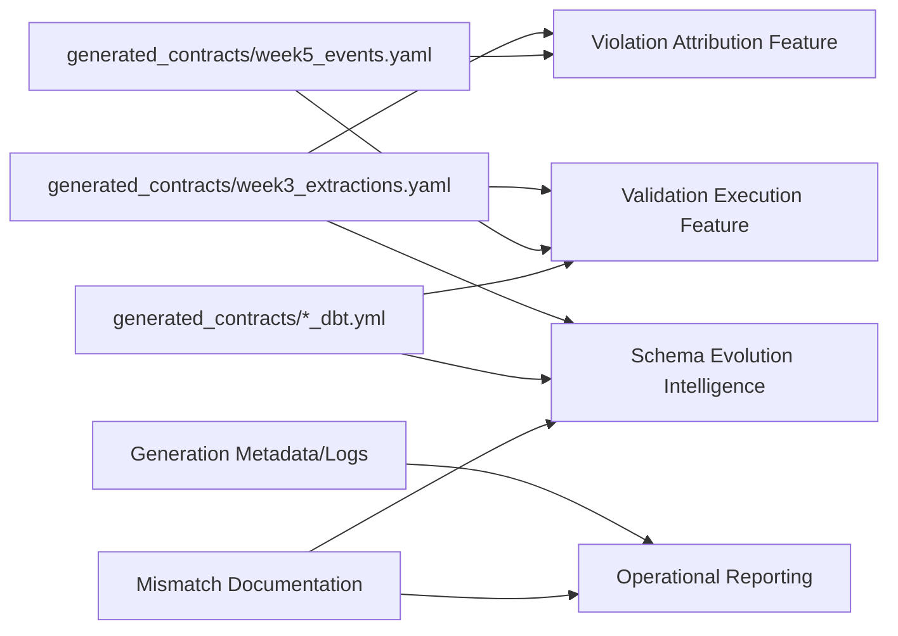

# Implementation Plan: Contract Generation Engine

**Branch**: `002-contract-generation-engine` | **Date**: 2026-04-02 | **Spec**: [spec.md](specs/002-contract-generation-engine/spec.md)
**Input**: Feature specification from `specs/002-contract-generation-engine/spec.md`

## Summary

Build a production-grade Python contract generator that consumes Feature 1 canonical artifacts and JSONL governed datasets, profiles structure/statistics, synthesizes contract clauses and requirement-driven invariants, injects lineage-aware downstream context, and writes deterministic Bitol-compatible + dbt-compatible YAML outputs to stable paths.

Primary first-class datasets:

- `outputs/week3/extractions.jsonl`
- `outputs/week5/events.jsonl`

Primary outputs:

- `generated_contracts/week3_extractions.yaml`
- `generated_contracts/week5_events.yaml`
- `generated_contracts/week3_extractions_dbt.yml`
- `generated_contracts/week5_events_dbt.yml`

## Technical Context

**Language/Version**: Python 3.11+  
**Primary Dependencies**: `pydantic` (typed models), `PyYAML` (YAML rendering), standard library (`json`, `pathlib`, `statistics`, `logging`, `hashlib`, `datetime`)  
**Storage**: File-based artifacts (JSONL/YAML/JSON/Markdown/Mermaid) in canonical repository paths  
**Testing**: `pytest` with unit + integration tests, golden-file diff checks for deterministic output  
**Target Platform**: Cross-platform CLI execution in evaluator environments (Windows-first, POSIX-compatible paths via `pathlib`)  
**Project Type**: Python CLI/library module within existing repository  
**Performance Goals**: End-to-end generation for Week 3 + Week 5 datasets within 60s on evaluator-scale data  
**Constraints**: Deterministic output ordering, no validation-runner execution, preserve canonical schema targets, explicit mismatch evidence  
**Scale/Scope**: Initial support for 2 datasets (week3/week5) with extension architecture for week1/week2/week4/traces without core redesign

## Constitution Check

_GATE: Must pass before Phase 0 research. Re-check after Phase 1 design._

- [x] Spec-first gate: Active spec exists and defines behavior, boundaries, and acceptance scenarios before implementation work.
- [x] Canonical structure gate: Plan preserves canonical repository layout established in Feature 1.
- [x] Compounding design gate: Artifacts are durable (`generated_contracts/*`, metadata, contract models) and reusable by downstream features.
- [x] Data contract gate: Contract clauses, lineage context, mismatch evidence, and stable outputs are first-class artifacts.
- [x] Evidence gate: Plan records observed-vs-canonical mismatch evidence and generation metadata from real inputs.
- [x] Python production gate: Clear module boundaries, typed models, deterministic rendering, reproducible command entry point.
- [x] Downstream impact gate: Ownership/consumer/lineage context embedded for later blast-radius and schema-evolution capabilities.
- [x] Operability gate: Structured outputs and logs are reviewable and translatable to plain-language operational guidance.
- [x] Prompt architecture gate: Feature design compounds Feature 1 and avoids temporary checkpoint framing.

Post-design re-check: **PASS** (no constitution violations introduced by Phase 1 design artifacts).

## Project Structure

### Documentation (this feature)

```text
specs/002-contract-generation-engine/
├── plan.md
├── research.md
├── data-model.md
├── quickstart.md
├── contracts/
│   └── generator-artifacts.md
└── tasks.md
```

### Source Code (repository root)

```text
contracts/
├── generator.py                 # Primary entry point/orchestrator
├── schema_analyzer.py           # Structural + statistical profiling helpers
├── canonical_paths.yaml         # Feature 1 canonical path inventory
├── dataset_readiness.json       # Feature 1 readiness inventory
├── interface_registry.yaml      # Feature 1 interface metadata
├── schema_ownership_map.yaml    # Feature 1 ownership metadata
├── data_flow_architecture.mmd   # Feature 1 architecture reference
└── requirement_traceability.yaml

src/
├── models/
│   ├── readiness_models.py
│   └── contract_models.py       # NEW: generated contract internal model
├── validators/
│   ├── path_validator.py
│   └── contract_quality_validator.py  # NEW: deterministic and completeness checks
├── cli/
│   └── foundation.py
└── generation/
            ├── dataset_loader.py        # NEW: JSONL loading and malformed-line handling
            ├── profilers.py             # NEW: structural + statistical profiling
            ├── schema_inference.py      # NEW: nested field model + flatten mapping
            ├── invariant_synthesizer.py # NEW: inferred + requirement-driven clauses
            ├── lineage_injector.py      # NEW: downstream context injection
            ├── renderers.py             # NEW: Bitol/dbt YAML rendering
            └── deterministic_writer.py  # NEW: stable ordering + atomic write

generated_contracts/
├── week3_extractions.yaml
├── week3_extractions_dbt.yml
├── week5_events.yaml
└── week5_events_dbt.yml

schema_snapshots/
└── index.json

validation_reports/
└── readiness_index.json

violation_log/
└── mismatch_index.json
```

**Structure Decision**: Reuse existing root canonical paths and place new Python generation modules under `src/generation/` while keeping `contracts/generator.py` as the orchestrating entry point.

## Architecture Plan

### 1) Input dataset loading from canonical JSONL paths

- Resolve dataset targets from `contracts/canonical_paths.yaml`.
- Validate readiness with `contracts/dataset_readiness.json` before generation.
- Load JSONL line-by-line with resilient parsing: - valid records collected, - malformed records captured as evidence in metadata.

### 2) Dataset profiling

- Structural profiling: - field discovery (including nested objects/arrays where feasible), - nullability/presence rates, - type consistency map.
- Statistical profiling: - numeric min/max/mean/quantile candidates, - value distribution summaries for enum candidacy, - uniqueness indicators and sparsity.

### 3) Schema inference and nested field handling

- Maintain both: - canonical nested path representation (`a.b.c`), and - dbt-compatible flattened test-target references.
- Preserve parent-child links for nested fields to avoid semantic loss.

### 4) Contract clause generation

- Synthesize clauses for: - required/not-null, - ranges, - enums/accepted values, - patterns, - positivity, - monotonicity candidates, - referential relationships, - dataset-level checks.

### 5) Requirement-driven clause injection

- Read requirement constraints from Feature 1 traceability/domain notes.
- Inject known invariants even if sample data does not violate them.
- Mark source attribution per clause (`inferred` vs `requirement_defined`).

### 6) Lineage-aware downstream consumer context injection

- Consume: - `contracts/interface_registry.yaml` - `contracts/schema_ownership_map.yaml` - `outputs/week4/lineage_snapshots.jsonl` (when available)
- Embed downstream context in each contract: - downstream systems, - consumed fields, - likely breaking fields, - consumer-facing change sensitivity.

### 7) Output rendering to Bitol-compatible YAML

- Render deterministic key ordering and deterministic list ordering.
- Include explicit mismatch and uncertainty sections.

### 8) Output rendering to dbt-compatible schema YAML

- Emit counterpart tests for supported clauses: - not_null, - accepted_values, - relationships, - unique.
- Record unsupported clause mappings explicitly in metadata.

### 9) Generation metadata, logging, and deterministic file writing

- Log run id, input artifact versions/hashes, record counts, parse errors, mismatch counts.
- Determinism rules: - stable sorting by dataset + field path + clause type, - normalized YAML emitter settings, - only timestamp/version fields allowed to vary.
- Write temp file + atomic replace to reduce partial-write risk.

### 10) Extensibility to additional governed datasets

- Dataset-agnostic orchestration pipeline keyed by dataset config.
- Add dataset via registry/config mapping, not generator code fork.

## Failure Handling

- Missing input dataset path: - fail dataset-specific generation with clear error, - continue other dataset generation, - emit metadata status `blocked_by_missing_upstream_data`.
- Malformed JSONL lines: - continue parsing valid lines, - record malformed-line diagnostics and count.
- Partial conformance to canonical schema: - still generate baseline contract, - emit mismatch evidence (filename/shape/field/semantic), - keep canonical target semantics unchanged.
- Missing optional lineage assets: - generate contracts with explicit `partial_context` annotations.

## Output Naming & Versioning Conventions

- File naming (fixed): - `generated_contracts/week3_extractions.yaml` - `generated_contracts/week5_events.yaml` - `generated_contracts/week3_extractions_dbt.yml` - `generated_contracts/week5_events_dbt.yml`
- Contract metadata fields: - `generator_version` - `contract_schema_version` - `generated_at` (allowed non-deterministic) - `input_artifact_hashes` - `dataset_record_count`

## Risks & Mitigations

| Risk                                             | Impact                        | Mitigation                                                                      |
| ------------------------------------------------ | ----------------------------- | ------------------------------------------------------------------------------- |
| Inconsistent nested structures across records    | Unstable inferred schema      | Use unioned field graph with confidence annotations and explicit unknown typing |
| Overfitting enum/range clauses to small samples  | False strictness              | Mark inferred confidence, prefer requirement-defined invariants where available |
| Non-deterministic YAML serialization             | Poor review/diff experience   | Stable sorting + canonical dumper settings + golden-file tests                  |
| Missing Week 4 lineage data                      | Incomplete downstream context | Emit partial-context markers and preserve extension points                      |
| Drift between canonical target and observed data | Downstream breakage           | Always preserve canonical schema target and emit mismatch evidence              |

## Mermaid Diagrams

### 1) Contract Generation Pipeline

```mermaid
flowchart LR
            A[Canonical Dataset Registry] --> B[Dataset Loader]
            B --> C[Structural Profiler]
            B --> D[Statistical Profiler]
            C --> E[Schema Inference]
            D --> E
            E --> F[Invariant Synthesizer]
            G[Requirement Traceability + Domain Notes] --> F
            H[Interface/Ownership + Week4 Lineage] --> I[Lineage Context Injector]
            F --> I
            I --> J[Bitol YAML Renderer]
            I --> K[dbt YAML Renderer]
            J --> L[Deterministic Writer]
            K --> L
            L --> M[generated_contracts/*.yaml|*.yml]
            L --> N[Generation Metadata/Logs]
```

### 2) Data and Metadata Dependencies into Generator

```mermaid
flowchart TB
            subgraph Feature1[Feature 1 Canonical Artifacts]
                  P1[contracts/canonical_paths.yaml]
                  P2[contracts/dataset_readiness.json]
                  P3[contracts/interface_registry.yaml]
                  P4[contracts/schema_ownership_map.yaml]
                  P5[contracts/data_flow_architecture.mmd]
                  P6[DOMAIN_NOTES.md + requirement_traceability.yaml]
            end

            subgraph Inputs[Governed Dataset Inputs]
                  D1[outputs/week3/extractions.jsonl]
                  D2[outputs/week5/events.jsonl]
                  D3[outputs/week4/lineage_snapshots.jsonl optional]
            end

            P1 --> G[contracts/generator.py]
            P2 --> G
            P3 --> G
            P4 --> G
            P5 --> G
            P6 --> G
            D1 --> G
            D2 --> G
            D3 --> G
```



### 3) Generated Artifact Flow into Later Platform Features



## Complexity Tracking

No constitution violations requiring exceptions.
