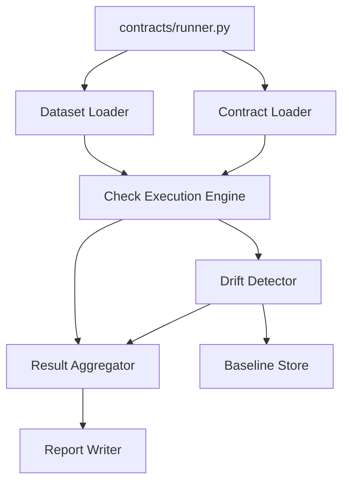
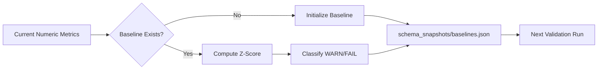

# Implementation Plan: Validation Execution and Drift Detection Engine

**Branch**: `003-validation-drift-engine` | **Date**: 2026-04-02 | **Spec**: [spec.md](specs/003-validation-drift-engine/spec.md)
**Input**: Feature specification from `specs/003-validation-drift-engine/spec.md`

## Summary

Build a production-grade Python validation engine that executes Feature 2 generated contracts against Feature 1 canonical datasets, classifies validation outcomes (`PASS`/`FAIL`/`WARN`/`ERROR`), persists numeric drift baselines, and emits deterministic machine-readable validation reports for downstream features.

## Technical Context

**Language/Version**: Python 3.11+  
**Primary Dependencies**: `PyYAML` (contract parsing), `pydantic` (typed models), standard library (`json`, `pathlib`, `re`, `statistics`, `datetime`, `hashlib`)  
**Storage**: File-based artifacts (`generated_contracts/*.yaml`, `outputs/**/*.jsonl`, `schema_snapshots/baselines.json`, `validation_reports/*.json`)  
**Testing**: `pytest` with unit tests for check evaluators and integration tests for end-to-end runner outputs  
**Target Platform**: Cross-platform CLI execution (Windows-first, POSIX-compatible paths via `pathlib`)  
**Project Type**: Python CLI + internal validation modules  
**Performance Goals**: Execute week3/week5 contract validations on evaluator-scale JSONL within 60s, memory-safe for large files through streaming/chunked processing  
**Constraints**: Never halt full run on bad data; strict fixed report schema; deterministic ordering and sampling; only `report_id` and `run_timestamp` may vary across unchanged runs  
**Scale/Scope**: Initial scope validates canonical week3/week5 datasets with extension-ready architecture for additional datasets/contracts

## Constitution Check

_GATE: Must pass before Phase 0 research. Re-check after Phase 1 design._

- [x] Spec-first gate: Active spec exists with clarified behavior and acceptance scenarios.
- [x] Canonical structure gate: Uses canonical paths (`contracts/runner.py`, `generated_contracts/`, `outputs/`, `schema_snapshots/`, `validation_reports/`) without deviation.
- [x] Compounding design gate: Produces durable validation reports and baselines reused by Features 4–7.
- [x] Data contract gate: Contract clauses, validation outputs, and drift baselines are first-class artifacts with stable locations.
- [x] Evidence gate: Validation and drift outputs are generated from actual dataset snapshots or explicitly injected test data.
- [x] Python production gate: Clear module boundaries, typed internal models, deterministic execution, reproducible CLI entry point.
- [x] Downstream impact gate: Output schema and compatibility rules preserve downstream consumer expectations.
- [x] Operability gate: Reports include structured diagnostics (`message`, `expected`, `actual_value`, failing samples) for plain-language translation.
- [x] Prompt architecture gate: Feature extends prior architecture and avoids temporary checkpoint framing.

Post-design re-check: **PASS**.

## Architecture & Design Decisions

### Validation execution model

- **Per-field checks**: `required`, `nullability`, `type`, `pattern`, `range`, `enum` against resolved field values.
- **Per-record checks**: Cross-field predicates and relationship conditions evaluated record-by-record.
- **Dataset-level checks**: `row_count`, `uniqueness`, `referential_integrity` evaluated over full snapshot.

### Nested field handling strategy

- **Objects**: schema-walk by contract path (e.g., `entity.score`).
- **Arrays**: wildcard iteration semantics (e.g., `items[*].price`) with deterministic traversal preserving dataset record order and array index order.

### Error handling strategy

- Runner never crashes due to bad data.
- Missing columns and unexpected structures are emitted as `ERROR` result rows.
- Invalid type/value constraint violations are emitted as `FAIL`.
- Unsupported check types emit `ERROR` with explicit reason and continue.

### Baseline storage and updates

- Single canonical file: `schema_snapshots/baselines.json`.
- Baseline key granularity: `contract_id + field_path + check_type=drift_mean`.
- Stored stats: `mean`, `stddev`, `min`, `max`, `sample_size`, `created_at`, `updated_at`.
- First successful numeric run initializes baseline.
- Default mode is immutable baseline (no overwrite).
- Optional explicit refresh mode allows controlled overwrite with audit metadata.

### Deterministic output strategy

- Stable contract iteration by sorted contract filename/`contract_id`.
- Stable check ordering by tuple: `(column_name, check_type, check_id)`.
- Stable result ordering in report using check ordering plus canonical record position.
- Deterministic `sample_failing`: first `N` failing records in canonical input order.
- Byte-stable report payload across unchanged runs except `report_id` and `run_timestamp`.

### Large JSONL performance strategy

- Streaming JSONL reader default for low memory pressure.
- Optional chunk aggregation layer for dataset-level metrics.
- Single-pass metric accumulation where possible (row count, null count, mean/stddev components).
- Controlled bounded sample capture for `sample_failing` to avoid unbounded memory growth.

## Project Structure

### Documentation (this feature)

```text
specs/003-validation-drift-engine/
├── plan.md
├── research.md
├── data-model.md
├── quickstart.md
├── contracts/
│   └── validation-artifacts.md
├── checklists/
│   ├── requirements.md
│   └── validation.md
└── tasks.md
```

### Source Code (repository root)

```text
contracts/
└── runner.py                         # Feature 3 entry point

src/
├── validation/
│   ├── contract_loader.py            # generated_contracts/*.yaml -> internal checks
│   ├── dataset_loader.py             # JSONL streaming + field extraction
│   ├── check_engine.py               # per-field/per-record/dataset-level execution
│   ├── drift_detector.py             # z-score drift classification
│   ├── baseline_store.py             # schema_snapshots/baselines.json IO/update policy
│   ├── result_aggregator.py          # counters and deterministic ordering
│   └── report_writer.py              # fixed schema writer
├── models/
│   └── validation_models.py          # check/result/report typed models
└── validators/
    └── validation_report_validator.py # fixed report schema compliance

schema_snapshots/
└── baselines.json

validation_reports/
└── {contract_id}_{timestamp}.json
```

**Structure Decision**: Keep canonical root paths and add Feature 3 internals under `src/validation/` with `contracts/runner.py` as the only orchestrating entry point.

## Contract-to-Executable Mapping Strategy

1. Load contract YAML and normalize clauses into internal `ExecutableCheck` records.
2. Map clause types to execution handlers:
   - `required`/`nullability`/`type`/`pattern` -> field validators
   - `range`/`enum` -> semantic field validators
   - `relationship` -> per-record relational validator
   - `row_count`/`uniqueness`/`referential_integrity` -> dataset-level validators
3. Add synthetic drift checks for numeric fields with baseline support.
4. Execute checks with fail-safe wrappers that convert exceptions to `ERROR` results.

## Mermaid Diagrams

### 1) Validation pipeline



### 2) Data flow from contracts + datasets to report

```mermaid
flowchart LR
    C1[generated_contracts/*.yaml] --> M[ExecutableCheck Model]
    D1[outputs/.../*.jsonl] --> S[Snapshot Stream]
    M --> X[Validation Execution]
    S --> X
    X --> R[results[]]
    R --> W[validation_reports/{contract_id}_{timestamp}.json]
```

### 3) Baseline feedback loop



## Complexity Tracking

No constitution violations requiring exceptions.
