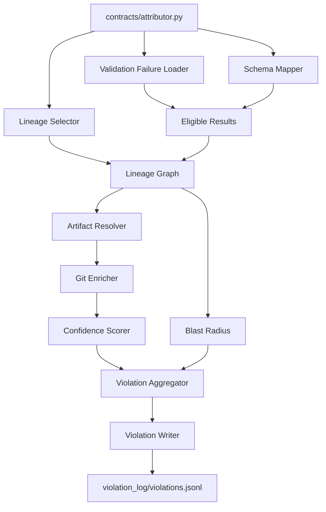
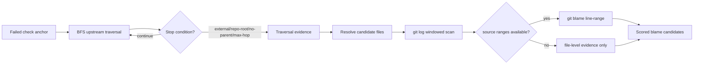
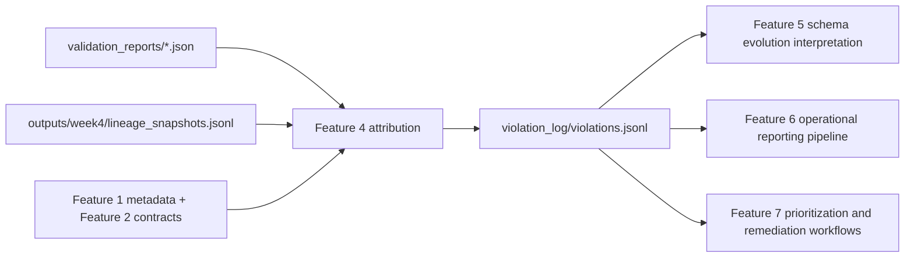

# Implementation Plan: Violation Attribution and Blast Radius Analysis

**Branch**: `004-violation-attribution` | **Date**: 2026-04-04 | **Spec**: [spec.md](specs/004-violation-attribution/spec.md)
**Input**: Feature specification from `specs/004-violation-attribution/spec.md`

## Summary

Build a production-grade Python attribution capability that consumes Feature 3
validation failures, maps them to governed schema/interface context from Feature
1 and contracts from Feature 2, traverses Week 4 lineage upstream to infer
plausible origins, enriches candidates with git history (and optional line-level
blame), computes bounded confidence-ranked blame chains, computes downstream
blast radius, and persists deterministic machine-readable violations to
`violation_log/violations.jsonl`.

## Technical Context

**Language/Version**: Python 3.11+  
**Primary Dependencies**: `pydantic` (typed models), `PyYAML` (Feature 1/2 artifacts), standard library (`json`, `pathlib`, `subprocess`, `datetime`, `hashlib`, `collections`)  
**Storage**: File-based artifacts (`validation_reports/*.json`, `outputs/week4/lineage_snapshots.jsonl`, `contracts/*.yaml|json`, `generated_contracts/*.yaml`, `violation_log/violations.jsonl`)  
**Testing**: `pytest` unit + integration tests for attribution mapping, lineage traversal, git enrichment, scoring, and record writing  
**Target Platform**: Cross-platform CLI execution (Windows-first, POSIX-compatible path handling via `pathlib`)  
**Project Type**: Python CLI + internal attribution modules  
**Performance Goals**: Attribute all violations from canonical week3/week5 reports in <60s on evaluator datasets; bounded runtime under configurable hop and commit limits  
**Constraints**: Deterministic ordering; bounded blame chain cardinality; append-safe writer; graceful degradation on missing lineage/git; no validation execution, no schema evolution classification, no stakeholder report generation  
**Scale/Scope**: Initial scope handles current canonical validation reports and lineage snapshots; architecture is extension-ready for additional contracts and datasets

## Constitution Check

_GATE: Must pass before Phase 0 research. Re-check after Phase 1 design._

- [x] Spec-first gate: Active spec exists with behavior, boundaries, and acceptance scenarios.
- [x] Canonical structure gate: Uses canonical paths (`contracts/attributor.py`, `validation_reports/`, `outputs/week4/`, `violation_log/`) without deviation.
- [x] Compounding design gate: Produces durable violation records and confidence/blast context reusable by later features.
- [x] Data contract gate: Validation outputs, lineage mappings, ownership/interface metadata, and violation records are treated as first-class artifacts.
- [x] Evidence gate: Attribution derives from real validation reports, lineage snapshots, and local git evidence (or explicit uncertainty when missing).
- [x] Python production gate: Clear module boundaries, typed models, deterministic ordering, and reproducible CLI entry point are defined.
- [x] Downstream impact gate: Blast radius model captures consumers/interfaces/pipelines and direct-vs-indirect impact.
- [x] Operability gate: Persisted outputs are machine-readable and structured for downstream operational translation.
- [x] Prompt architecture gate: Feature builds on prior approved features and avoids checkpoint-only framing.

Post-design re-check: **PASS**.

## Architecture & Design Decisions

### 1) Attribution eligibility filter

- Trigger attribution for `FAIL` plus selected attributable `ERROR` classes.
- Selected `ERROR` classes: `missing_column`, `unexpected_structure`, `invalid_type`.
- Exclude non-attributable execution/system errors: contract load failure,
  dataset load failure, malformed report payload, unsupported check type.
- Output explicit skip reason for every non-eligible validation result.

### 2) Mapping failures to governed schema elements

- Primary key: `column_name` when present (field-level anchor).
- Secondary key: parse `check_id` to extract contract and dataset-level rule anchors.
- For dataset-level failures with no single field anchor, map to governed dataset
  node + interface/ownership constraints using Feature 1 artifacts.
- Attribution applies only if mapped to at least one governed dataset, interface,
  or lineage node; otherwise emit non-attributable structured skip.

### 3) Latest lineage snapshot selection

- Source: `outputs/week4/lineage_snapshots.jsonl`.
- Select latest valid snapshot by in-record timestamp key if present
  (`snapshot_timestamp`, `captured_at`, `run_timestamp` in precedence order).
- If no timestamp exists, use deterministic fallback: highest valid line index in
  canonical file order.
- Invalid JSON lines are skipped and recorded as lineage-quality warnings.

### 4) Lineage traversal strategy

- Direction: from failing schema element toward upstream producer nodes.
- Strategy: breadth-first search (BFS).
- Stopping conditions: 1. external boundary reached, 2. repository root boundary reached, 3. no further upstream nodes, 4. maximum hop count reached (default: 6).
- All truncations/boundary stops are explicitly recorded in candidate evidence.

### 5) Git enrichment strategy

- Candidate file mapping from lineage node metadata + ownership/interface anchors.
- Recent history window: last 90 days, capped at 200 commits per candidate file.
- File-level candidates gathered via `git log --since=<window> --max-count=<cap> -- <path>`.
- Commit association: commits that touch candidate file paths are linked with
  hash, author, authored date, and summary metadata.
- Optional line-level blame used only when source ranges are known.

### 6) Source range derivation for blame

- Prefer upstream metadata from lineage/context: `source_file`,
  `source_line_start`, `source_line_end` (or equivalent canonical keys).
- If complete range metadata is present, run `git blame` for that line span and
  enrich candidate scoring.
- If range metadata is absent/partial, skip blame and continue with file-level
  history; uncertainty is explicitly marked.

### 7) Confidence scoring (bounded and normalized)

- Score range: 0–100.
- Weighted additive formula (normalized inputs):

      `score = 100 * (0.30*recency + 0.25*hop_proximity + 0.20*directness + 0.15*line_blame + 0.10*lineage_completeness)`

- Factor normalization: - `recency`: 1.0 for newest commit in window, decays to 0.0 at window edge. - `hop_proximity`: `1 - (hops/max_hops)` clamped 0..1. - `directness`: exact field↔file link=1.0, schema-level=0.7,
  dataset/interface-level=0.5, inferred-only=0.3. - `line_blame`: 1.0 when line-level blame evidence available, else 0.4. - `lineage_completeness`: full path=1.0, partial=0.5, weak/missing=0.2.

- Candidate count bounds: minimum 1 (for attributable violations), maximum 5.
- Stable ranking: score desc, hop count asc, commit timestamp desc, commit hash
  lexicographic asc.
- Low-confidence representation: - `confidence_band`: `high` (>=75), `medium` (>=50,<75), `low` (<50) - `uncertainty_reasons[]` always populated for non-high confidence.

### 8) Blast radius computation

- Compute downstream impact from mapped lineage node using downstream traversal
  plus Feature 1 interface registry and ownership metadata.
- Required dimensions in `blast_radius`: - `affected_nodes[]` - `affected_pipelines[]` - `affected_interfaces[]` - `estimated_impacted_records` and/or `estimated_impacted_datasets`
- Direct vs indirect impact: - direct = one hop downstream - indirect = two or more hops downstream
- Partial knowledge is explicit via completeness flags and unknown counts.

### 9) Deterministic append-safe writer

- Output path: `violation_log/violations.jsonl`.
- One JSON object per attributed violation.
- Deterministic ordering prior to write: by `detected_at`, `contract_id`,
  `check_id`, `violation_id`.
- Append-safe strategy: - compute deterministic `violation_id` hash from stable identity fields, - read lightweight index of existing ids, - skip duplicates on rerun by default, - optional explicit overwrite mode (out of default flow).

## Project Structure

### Documentation (this feature)

```text
specs/004-violation-attribution/
├── plan.md
├── research.md
├── data-model.md
├── quickstart.md
├── contracts/
│   └── violation-artifacts.md
├── checklists/
│   ├── requirements.md
│   └── attribution.md
└── tasks.md
```

### Source Code (repository root)

```text
contracts/
└── attributor.py                         # Feature 4 entry point

src/
├── attribution/
│   ├── validation_failure_loader.py      # load/filter eligible validation results
│   ├── schema_mapper.py                  # check_id/column_name -> governed elements
│   ├── lineage_selector.py               # latest valid week4 snapshot selection
│   ├── lineage_graph.py                  # BFS upstream/downstream traversal
│   ├── artifact_resolver.py              # lineage node -> repo artifact/file mapping
│   ├── git_enricher.py                   # git log + optional git blame integration
│   ├── confidence_scorer.py              # normalized weighted scoring
│   ├── blast_radius.py                   # downstream impact aggregation
│   ├── violation_writer.py               # append-safe JSONL writer
│   └── result_aggregator.py              # deterministic ordering + run summary
├── models/
│   └── attribution_models.py             # typed violation/candidate/blast models
└── validators/
            └── violation_record_validator.py     # record schema enforcement

violation_log/
└── violations.jsonl
```

**Structure Decision**: Preserve canonical entry point in `contracts/attributor.py` and place Feature 4 internals under `src/attribution/` with typed models and validators.

## Internal Data Model (Attributable Violation)

- **AttributionEligibleResult**: contract/report/check identity, status, check
  metadata, mapped schema anchors, eligibility reason.
- **SchemaAnchor**: dataset id, contract id, field path or dataset-rule anchor,
  interface/ownership references.
- **LineagePathEvidence**: source node, traversed nodes, hop count, stop reason,
  completeness state.
- **CommitEvidence**: file path, commit hash, author, authored_at,
  commit_summary, line_range (optional), blame_used.
- **BlameCandidate**: candidate id, source node, evidence bundle,
  factor scores, normalized score, confidence band, uncertainty reasons.
- **BlastRadiusSummary**: direct/indirect impacted nodes, interfaces, pipelines,
  estimated impacted records/datasets, completeness fields.
- **ViolationRecord**: `violation_id`, `check_id`, `detected_at`,
  `contract_id`/`dataset_id`, `blame_chain[]`, `blast_radius{}`,
  optional `attribution_confidence_summary`.

## Risk Register & Mitigations

1. **Sparse lineage data**
   - Risk: weak upstream/downstream mapping.
   - Mitigation: explicit partial completeness states; still emit structured
     record with low confidence.
2. **Missing git history or shallow clones**
   - Risk: underpowered candidate ranking.
   - Mitigation: degrade to lineage-only candidate generation with uncertainty
     reasons.
3. **Ambiguous many-to-many field/file mapping**
   - Risk: false precision in blame.
   - Mitigation: cap candidates, preserve uncertainty, rank deterministically.
4. **Non-deterministic reruns due to unordered inputs**
   - Risk: unstable downstream incident ingestion.
   - Mitigation: stable ordering keys and deterministic ID hashing.

## Mermaid Diagrams

### 1) Attribution pipeline



### 2) Lineage traversal and git enrichment flow



### 3) Violation record flow to later platform features



## Complexity Tracking

No constitution violations requiring exceptions.
