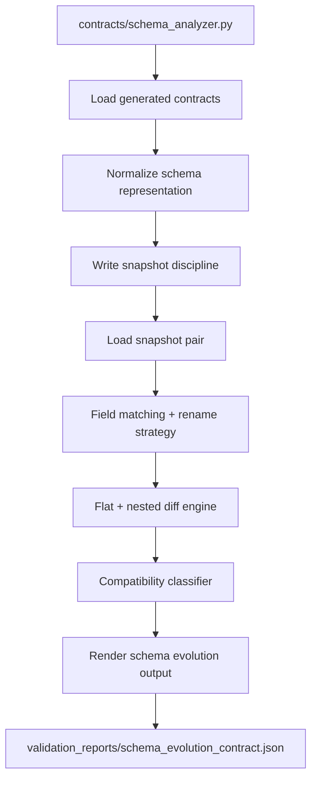
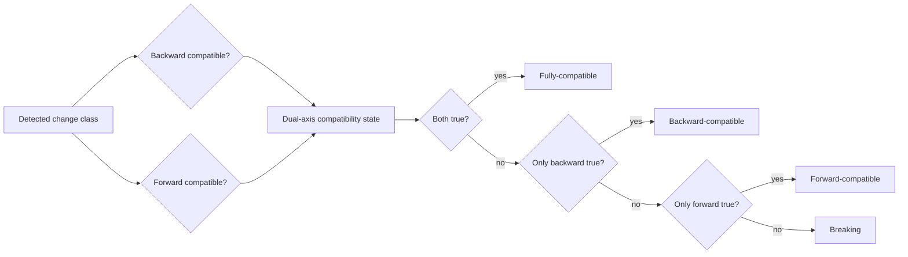
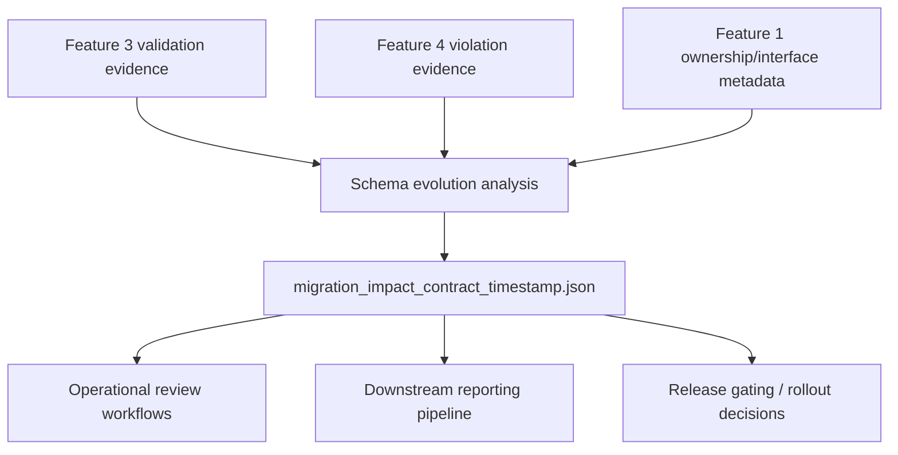

# Implementation Plan: Schema Evolution Intelligence

**Branch**: `005-schema-evolution-intelligence` | **Date**: 2026-04-04 | **Spec**: [spec.md](specs/005-schema-evolution-intelligence/spec.md)
**Input**: Feature specification from `specs/005-schema-evolution-intelligence/spec.md`

## Summary

Build a production-grade Python schema evolution capability that snapshots
contract schemas over time, computes deterministic flat/nested diffs, classifies
changes by compatibility taxonomy, and emits operational migration intelligence.
The feature consumes Feature 1 metadata (ownership/interfaces), Feature 2
contracts (schema source), and optionally Feature 3/4 evidence for severity and
prioritization enrichment while remaining fully functional without optional
context.

## Technical Context

**Language/Version**: Python 3.11+  
**Primary Dependencies**: `pydantic` (typed models), `PyYAML` (contract/metadata loading), standard library (`json`, `pathlib`, `hashlib`, `datetime`, `dataclasses`, `re`)  
**Storage**: File-based artifacts (`generated_contracts/*.yaml`, `schema_snapshots/{contract_id}/`, `contracts/*.yaml|json`, `validation_reports/*.json`, `violation_log/violations.jsonl`)  
**Testing**: `pytest` unit + integration tests for snapshot writing, diffing, taxonomy classification, deterministic rendering, and enrichment fallback paths  
**Target Platform**: Cross-platform CLI execution (Windows-first, POSIX-compatible via `pathlib`)  
**Project Type**: Python CLI + internal analysis modules  
**Performance Goals**: Analyze canonical Week 3 + Week 5 contracts in <30s on evaluator datasets; deterministic output generation for unchanged inputs  
**Constraints**: Deterministic ordering, stable IDs, graceful degradation with missing snapshots/context, no validation execution, no git blame attribution, no final stakeholder report generation  
**Scale/Scope**: Initial scope covers Week 3/Week 5 contracts; architecture extends to Week 1/Week 2/Week 4/LangSmith traces

## Constitution Check

_GATE: Must pass before Phase 0 research. Re-check after Phase 1 design._

Post-design re-check: **PASS**.

## Architecture & Design Decisions

### 1) Snapshot writing and storage discipline

      - automatic on successful contract-generation outputs (Feature 2 handoff discipline)
      - explicit on-demand snapshot command via `contracts/schema_analyzer.py --snapshot`
      - primary: normalized schema extracted from `generated_contracts/*.yaml`
      - optional auxiliary inferred representation from clause metadata for comparison hints
      - `schema_snapshots/{contract_id}/snapshot_{timestamp}_{schema_hash}.json`
      - `snapshot_id` (stable hash over normalized schema)
      - `snapshot_timestamp` (UTC ISO-8601, `YYYY-MM-DDTHH:MM:SSZ`)
      - `contract_id`, `schema_version`, `source_contract_path`
      - if normalized schema hash matches latest snapshot for same `contract_id`, do not write duplicate snapshot
      - emit deterministic `no_material_change` event in analysis summary

### 2) Snapshot loading and normalization

      - canonical field path expansion for flat + nested structures
      - canonical sort order by path then attribute key
      - normalized scalar formatting (`type`, `enum`, `pattern`, numeric constraints, requiredness)
      - skipped with explicit warnings and quality flags
      - analysis continues if at least one valid comparison pair exists

### 3) Field matching and rename detection

      1. exact canonical field path match
      2. explicit rename mapping (when provided in metadata)
      3. constrained heuristic rename candidate with confidence threshold
      - high confidence required (path proximity + compatible type family + retained constraints)
      - below threshold => classify as `remove_field` + `add_field`
      - if unmatched ratio exceeds threshold, rename confidence downgraded globally and all uncertain pairs treated as add/remove

### 4) Deterministic diff computation (flat + nested)

      - `add_nullable_field`
      - `add_required_field`
      - `remove_field`
      - `rename_field`
      - `widen_type`
      - `narrow_type`
      - `change_enum_values`
      - `change_constraints` (range/pattern/requiredness)
      - `change_nested_structure`
      - `change_semantic_scale` (constraint-encoded semantic change)
      - compare clause-level constraints/rules independent of field add/remove
      1. additions
      2. removals
      3. renames
      4. modifications (type/enum/constraints/nested/semantic)
      - within each class: sorted by canonical path then stable change key

### 5) Compatibility taxonomy and classification rules

      - `is_backward_compatible`
      - `is_forward_compatible`
      - fully-compatible: backward=true and forward=true
      - backward-compatible: backward=true and forward=false
      - forward-compatible: backward=false and forward=true
      - breaking: backward=false and forward=false
      - add nullable field: backward-compatible (typically not forward-compatible)
      - add required field: breaking
      - remove field: breaking
      - rename field: breaking unless explicit compatibility mapping exists
      - widen type: typically backward-compatible
      - narrow type: typically breaking
      - enum narrowing: breaking
      - enum expansion: typically backward-compatible
      - stricter constraints/requiredness: breaking
      - relaxed constraints: usually backward-compatible
      - nested structure changes: assessed by path-level impact; parent shape removal is breaking
      - semantic scale change without type change: breaking unless explicit compatibility waiver

### 6) Severity, confidence, and migration guidance generation

      - schema-diff baseline remains primary
      - validation failures and violation evidence can elevate/downgrade severity/confidence and reprioritize actions
      - if absent, baseline still yields complete outputs
      - exact human-readable diff summary
      - machine-readable structured diff
      - compatibility verdict
      - affected downstream consumers
      - likely per-consumer failure modes
      - ordered migration checklist
      - rollback guidance for breaking changes
      - urgency enum (`low|medium|high|critical`)
      - checklist actions must be specific and actionable (owner + action + target + verification), not generic text

### 7) Graceful degradation behavior

      - if no prior snapshot, emit snapshot-only state and no diff verdict
      - skip malformed candidates; emit quality warnings and continue with valid pairs
      - continue with schema-only classification and migration guidance
      - continue classification, mark downstream impact completeness as partial

### 8) Deterministic output rendering

      - `validation_reports/schema_evolution_{contract_id}.json`
      - `migration_impact_{contract_id}_{timestamp}.json`
      - by `contract_id`, snapshot pair identity, change class order, canonical field path
      - `analysis_id` hash from `contract_id + from_snapshot_id + to_snapshot_id + normalized_diff_hash`

## Project Structure

### Documentation (this feature)

```text
specs/005-schema-evolution-intelligence/
├── plan.md
├── research.md
├── data-model.md
├── quickstart.md
├── contracts/
│   └── schema-evolution-artifacts.md
├── checklists/
│   ├── requirements.md
│   └── schema-evolution.md
└── tasks.md
```

### Source Code (repository root)

```text
contracts/
└── schema_analyzer.py

src/
├── evolution/
│   ├── snapshot_writer.py
│   ├── snapshot_loader.py
│   ├── normalizer.py
│   ├── matcher.py
│   ├── differ.py
│   ├── classifier.py
│   ├── context_enricher.py
│   ├── migration_generator.py
│   ├── renderer.py
│   └── pipeline.py
├── models/
│   └── schema_evolution_models.py
└── validators/
            └── schema_evolution_validator.py

schema_snapshots/
└── {contract_id}/

validation_reports/
└── schema_evolution_{contract_id}.json

migration_impact_{contract_id}_{timestamp}.json
```

**Structure Decision**: Keep CLI boundary at `contracts/schema_analyzer.py`; place feature internals under `src/evolution/` with typed models and validators for deterministic, testable behavior.

## Internal Data Model (Phase 1 baseline)

      - `snapshot_id`, `snapshot_timestamp`, `contract_id`, `schema_version`, `schema_hash`, `fields`, `rules`, `source`
      - `path`, `type`, `nullable`, `required`, `enum_values`, `pattern`, `constraints`, `nested_kind`
      - `from_path`, `to_path`, `match_type (exact|explicit_rename|heuristic_rename)`, `confidence`
      - `change_id`, `change_class`, `from_field`, `to_field`, `details`, `compatibility`
      - `is_backward_compatible`, `is_forward_compatible`, `verdict`, `rationale`
      - `order`, `owner`, `action`, `target_consumer`, `verification_step`, `rollback_step`
      - `contract_id`, `analysis_id`, `summary`, `structured_diff`, `compatibility_verdict`, `affected_consumers`, `failure_modes`, `migration_checklist`, `rollback_guidance`, `urgency`, `context_completeness`

## Risk Register & Mitigations

1. **Rename over-detection risk**
   - Mitigation: explicit mapping precedence + strict confidence threshold + add/remove fallback.
2. **Non-deterministic nested diff output**
   - Mitigation: canonical path flattening and stable sort keys before render.
3. **Missing prior snapshots**
   - Mitigation: deterministic “baseline established” mode with no false diff claims.
4. **Context artifact inconsistency (Feature 3/4)**
   - Mitigation: optional enrichment layer with explicit confidence/completeness flags.
5. **Generic migration advice**
   - Mitigation: enforce actionable checklist schema fields and validator rule set.

## Mermaid Diagrams

### 1) Snapshot and diff pipeline



### 2) Schema change classification flow



### 3) Migration impact output flow into later features



## Complexity Tracking

No constitution violations requiring exceptions.
