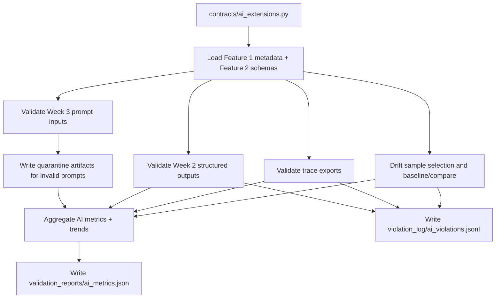
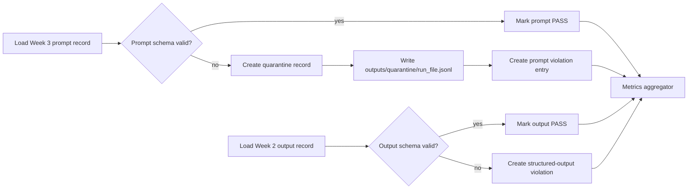
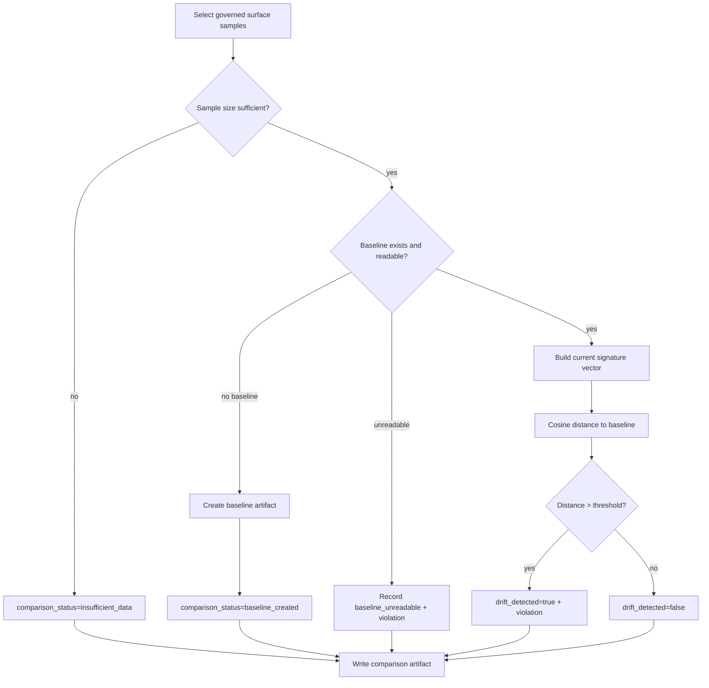

# Implementation Plan: AI Contract Enforcement Extensions

**Branch**: `006-ai-contract-enforcement` | **Date**: 2026-04-04 | **Spec**: [spec.md](specs/006-ai-contract-enforcement/spec.md)
**Input**: Feature specification from `specs/006-ai-contract-enforcement/spec.md`

## Summary

Implement a production-grade AI contract enforcement capability exposed through
`contracts/ai_extensions.py` that validates prompt inputs, structured outputs,
LangSmith trace exports, and deterministic embedding drift signals. The feature
produces durable machine-readable artifacts (`ai_metrics`, AI violations,
quarantine outputs, drift baselines/comparisons), reuses Features 1–5 artifacts
without redefining them, and preserves explicit separation from non-AI runner,
attribution, schema evolution classification, and final report generation.

## Technical Context

**Language/Version**: Python 3.11+  
**Primary Dependencies**: `pydantic`, `PyYAML`, Python standard library (`json`, `pathlib`, `hashlib`, `datetime`, `statistics`, `math`, `typing`)  
**Storage**: File-based artifact storage in canonical repository paths (`outputs/`, `validation_reports/`, `violation_log/`, `schema_snapshots/`, `generated_contracts/`, `contracts/`)  
**Testing**: `pytest` unit + integration coverage for validators, quarantine writes, drift baseline lifecycle, trend calculations, and CLI orchestration  
**Target Platform**: Cross-platform CLI (Windows-first dev workflow, POSIX-compatible path handling via `pathlib`)  
**Project Type**: Python CLI + internal enforcement modules  
**Performance Goals**: Complete Week 2 + Week 3 + trace validation and drift evaluation within 60s on evaluator-sized inputs; deterministic outputs for unchanged inputs  
**Constraints**: Deterministic ordering and IDs, no silent drops, atomic artifact writes, graceful degradation for optional/missing context, strict boundary isolation from Features 3/4/5 responsibilities  
**Scale/Scope**: Initial governed surfaces are Week 3 prompt inputs, Week 2 structured outputs, trace runs, and one approved AI text surface for drift

## Constitution Check

_GATE: Must pass before Phase 0 research. Re-check after Phase 1 design._

Pre-research gate review: **PASS**.

- [x] Spec-first gate: Active spec defines behavior, boundaries, scenarios, and measurable outcomes.
- [x] Canonical structure gate: Plan preserves required repository layout and approved artifact roots.
- [x] Compounding design gate: Produces durable metrics/violation/quarantine/drift artifacts reusable downstream.
- [x] Data contract gate: Governing schemas, validation outputs, and violation records are first-class with stable paths.
- [x] Evidence gate: Artifacts are generated from real or explicitly injected execution data.
- [x] Python production gate: Clear module boundaries, typed models, deterministic rendering, and reproducible CLI paths.
- [x] Downstream impact gate: Ownership, consumers, blast radius, and migration expectations are preserved through reused metadata.
- [x] Operability gate: Outputs include machine-readable structures suitable for plain-language translation later.
- [x] Prompt architecture gate: Feature extends approved architecture and avoids checkpoint framing.

Post-design re-check: **PASS**.

## Architecture & Design Decisions

### 1) Entry point and module architecture

- Keep `contracts/ai_extensions.py` as a thin CLI/orchestration boundary.
- Add internal package `src/ai_enforcement/`: - `pipeline.py` (orchestration) - `contract_loader.py` (Feature 2 schema resolution) - `prompt_validator.py` (Week 3 prompt input checks) - `output_validator.py` (Week 2 structured output checks) - `trace_validator.py` (trace contract checks) - `drift.py` (sample selection, baseline create/compare) - `metrics.py` (aggregation + trend calculations) - `quarantine_writer.py` (deterministic quarantine write) - `violation_writer.py` (AI violation persistence) - `renderer.py` (stable JSON serialization and artifact index)
- Add typed models in `src/models/ai_enforcement_models.py`.
- Add validators in `src/validators/ai_enforcement_validator.py`.

### 2) Prompt input schema validation and quarantine

- Governed source: `outputs/week3/extractions.jsonl`.
- Validate each record against Feature 2/optional prompt-input schema assets.
- Invalid prompt records MUST be quarantined to
  `outputs/quarantine/{run_timestamp}_{run_id}.jsonl` using deterministic record
  order (record ID ascending fallback to source order).
- Quarantine file strategy: - build temp file in same directory - write JSONL line-by-line - atomic replace to final filename
- Hard-fail rule: if any invalid prompts exist and quarantine write fails,
  terminate run non-zero (no silent drop allowed).

### 3) Structured output validation and violation-rate tracking

- Governed source: `outputs/week2/verdicts.jsonl`.
- Validate required fields, type constraints, nullability, and nested shape.
- Emit AI-specific violations under `violation_log/ai_violations.jsonl` for each
  failed contract condition.
- Maintain per-surface violation rates: - $rate = failures / max(processed, 1)$ - group by schema/prompt version where available
- Persist current run rates + bounded history into
  `validation_reports/ai_metrics.json`.

### 4) LangSmith trace contract validation

- Governed source: `outputs/traces/runs.jsonl`.
- Validate required run identifiers, timestamps, and contract-required event
  fields.
- Malformed timestamps or missing run IDs become trace-contract violations (not
  silent skips).
- Include trace pass/fail totals and rate in AI metrics.

### 5) Embedding sample selection, baseline, and comparison

- Surface selection: approved governed `surface_id` (initially one text surface
  from Week 3 extraction payloads).
- Deterministic signature algorithm: `token_hash_v1` fixed dimensions (256) and
  normalized tokenization rules.
- Baseline path strategy: - `schema_snapshots/ai/{surface_id}/baseline_token_hash_v1.json` - `schema_snapshots/ai/{surface_id}/comparison_{run_timestamp}_{run_id}.json`
- Baseline absent behavior: create baseline artifact and mark comparison status
  `baseline_created`.
- Insufficient sample behavior: status `insufficient_data`; do not force drift
  verdict.
- Unreadable baseline behavior: status `baseline_unreadable`, record violation,
  continue run with explicit completeness warning unless mandatory policy is set.

### 6) AI metric aggregation and rendering

- Produce one deterministic run summary file:
  `validation_reports/ai_metrics.json`.
- Required sections: - run metadata (`run_id`, `run_timestamp`) - totals (prompt/output/trace/drift counters) - rates - trend - artifact pointers - context completeness flags (Feature 1/2/3/5 availability)
- Serialization rules: - sorted keys - stable object ordering - atomic replace write

### 7) Optional helper reuse with strict boundaries

- Reuse Feature 3 conventions for statuses, severity scale, report/validator
  patterns, deterministic output ordering, and atomic file writes.
- Do not call or replace `contracts/runner.py` for non-AI workloads.
- Do not perform git attribution (`contracts/attributor.py`) or schema
  classification logic (`contracts/schema_analyzer.py`).
- Do not generate final stakeholder reports (`contracts/report_generator.py`).

### 8) Deterministic output and reviewability rules

- Stable IDs for run and violations derived from deterministic inputs where
  applicable.
- Deterministic sort order for all record collections.
- Explicit status values for all degraded/partial contexts.
- All generated artifacts include enough metadata to replay and audit.

## Project Structure

### Documentation (this feature)

```text
specs/006-ai-contract-enforcement/
├── plan.md
├── research.md
├── data-model.md
├── quickstart.md
├── contracts/
│   └── ai-enforcement-artifacts.md
├── checklists/
│   ├── requirements.md
│   └── ai-governance.md
└── tasks.md
```

### Source Code (repository root)

```text
contracts/
└── ai_extensions.py

src/
├── ai_enforcement/
│   ├── __init__.py
│   ├── pipeline.py
│   ├── contract_loader.py
│   ├── prompt_validator.py
│   ├── output_validator.py
│   ├── trace_validator.py
│   ├── drift.py
│   ├── metrics.py
│   ├── quarantine_writer.py
│   ├── violation_writer.py
│   └── renderer.py
├── models/
│   └── ai_enforcement_models.py
└── validators/
            └── ai_enforcement_validator.py

outputs/
└── quarantine/

schema_snapshots/
└── ai/{surface_id}/

validation_reports/
└── ai_metrics.json

violation_log/
└── ai_violations.jsonl
```

**Structure Decision**: Preserve existing repository conventions, add a dedicated
AI enforcement package, and keep durable outputs in canonical artifact roots.

## Internal Data Model (Phase 1 baseline)

- `AIEnforcementRun`: run metadata + context completeness flags.
- `PromptInputCheckRecord`: schema validation outcome per Week 3 prompt record.
- `StructuredOutputCheckRecord`: conformance outcome per Week 2 output record.
- `TraceContractCheckRecord`: trace contract result per trace record.
- `QuarantineRecord`: invalid prompt payload evidence entry.
- `AIViolationRecord`: unified AI-specific violation envelope across prompt,
  output, trace, and drift classes.
- `EmbeddingBaseline`: deterministic baseline signature metadata and vector.
- `EmbeddingComparisonResult`: per-run drift compare result with explicit status.
- `AIMetricsReport`: totals, rates, trend, artifacts, and completeness summary.

## Baseline Storage Strategy

- Drift baseline files stored by surface in `schema_snapshots/ai/{surface_id}/`.
- Baseline file includes algorithm/version/dimensions/sample filters/source paths.
- Comparison file per run references baseline ID and computed distance/threshold.
- Metrics trend history retained in bounded array (`window_size=10`) in
  `validation_reports/ai_metrics.json`.

## Quarantine Strategy

- File naming: `{run_timestamp}_{run_id}.jsonl` (UTC timestamp format
  `YYYYMMDDTHHMMSSZ`).
- Write policy: one file per run, deterministic line order, temp + atomic rename.
- Append policy: no cross-run appends; preserves isolation and replayability.

## Trend Calculation Strategy

- Base rates: `$r = failures / max(processed, 1)$` for each governed surface.
- Trend source: last 10 historical run rates for each metric.
- Trend function: linear slope over run index (deterministic, no time-gap bias).
- Trend statuses: - `insufficient_history` (<3 points) - `stable` (absolute slope below epsilon) - `improving` (negative slope for violation rates) - `degrading` (positive slope for violation rates)

## Behavior for Missing Baselines or Insufficient Data

- Missing baseline: create baseline, no drift-failure verdict, status
  `baseline_created`.
- Insufficient drift sample: status `insufficient_data`, emit warning and
  metrics evidence, no false drift verdict.
- Missing prior metrics history: initialize history and mark trend
  `insufficient_history`.
- Missing Feature 5 context: run continues with
  `context_completeness.feature5_context_loaded=false`.
- Missing mandatory output path/write capability: fail run with explicit error.

## Risk Register & Mitigations

1. **Boundary collapse with Feature 3 runner**
   - Mitigation: dedicated `contracts/ai_extensions.py` pipeline and explicit
     guardrails against delegating non-AI validation execution.
2. **Non-deterministic drift outcomes**
   - Mitigation: fixed algorithm (`token_hash_v1`), fixed dimension, fixed
     preprocessing, deterministic sample ordering.
3. **Silent prompt data loss risk**
   - Mitigation: hard-fail on quarantine write failure when invalid prompts are
     present; reconcile processed vs valid+quarantined counts.
4. **Ambiguous trend interpretation**
   - Mitigation: explicit slope-based method, fixed window, and status enum in
     metrics output.
5. **Optional context inconsistency (Features 1/5)**
   - Mitigation: context completeness flags and warning channels; never silently
     assume ownership/migration context.

## Mermaid Diagrams

### 1) AI contract enforcement pipeline



### 2) Prompt input and structured output validation flow



### 3) Embedding drift baseline and comparison flow



## Complexity Tracking

No constitution violations requiring exceptions.
