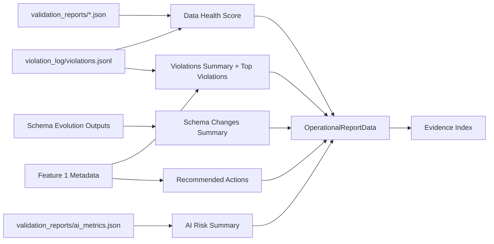
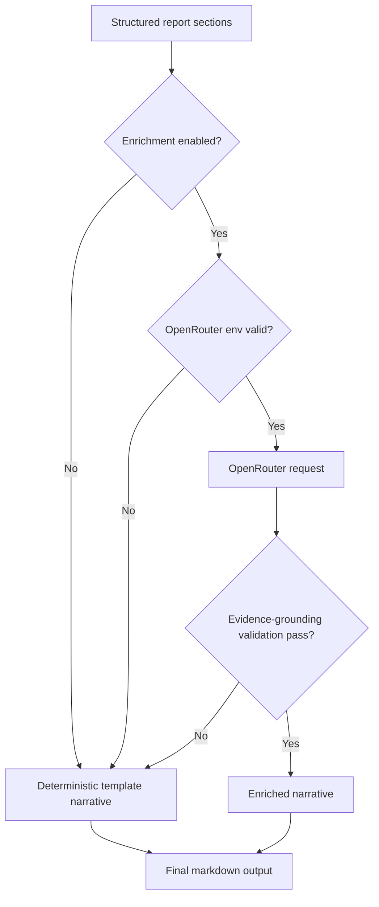

# Implementation Plan: Operational Report Generation

**Branch**: `007-operational-report-generation` | **Date**: 2026-04-04 | **Spec**: [spec.md](./spec.md)
**Input**: Feature specification from `/specs/007-operational-report-generation/spec.md`

## Summary

Implement a production-grade reporting capability at `contracts/report_generator.py`
that reads existing platform evidence artifacts (Features 1, 3, 4, 5, 6), resolves
a deterministic reporting window, computes operational summaries including the Data
Health Score, ranks significant risks, generates evidence-grounded recommended
actions, and writes both `enforcer_report/report_data.json` and
`enforcer_report/report_{date}.md`. Optional narrative enrichment is supported via
OpenRouter environment configuration only and must always degrade to deterministic
non-LLM output without blocking report generation.

## Technical Context

**Language/Version**: Python 3.11+  
**Primary Dependencies**: Standard library (`json`, `pathlib`, `datetime`, `statistics`, `os`, `hashlib`, `urllib.request`), `pydantic>=2.6`, `PyYAML>=6.0`  
**Storage**: File-based artifacts in repository paths (read-only upstream inputs + generated report outputs)  
**Testing**: `pytest>=8.0` with deterministic fixture artifacts and golden-output assertions  
**Target Platform**: Cross-platform CLI execution (Windows + Linux evaluator environments)  
**Project Type**: Python CLI + supporting domain package modules  
**Performance Goals**: End-to-end report generation under 5s for typical repository artifact volumes (<10k violation records)  
**Constraints**: Deterministic ordering and stable key layout; no required network dependency; optional OpenRouter use only; no fabricated evidence  
**Scale/Scope**: One report per run over bounded reporting window; multi-source aggregation from five upstream artifact families

## Constitution Check

_GATE: Must pass before Phase 0 research. Re-check after Phase 1 design._

- [x] Spec-first gate: Active spec exists and defines behavior, boundaries, and
      acceptance scenarios before implementation work.
- [x] Canonical structure gate: Plan preserves canonical repository layout and
      adds only feature-scoped reporting modules and artifacts.
- [x] Compounding design gate: Report data model, evidence index, and renderers
      are reusable by future alerting/dashboard and PDF export features.
- [x] Data contract gate: Stable artifact paths are explicit inputs/outputs and
      remain first-class across loading, aggregation, and rendering.
- [x] Evidence gate: All claims/actions derive from upstream artifacts or
      explicitly injected test data; missing evidence is labeled, never invented.
- [x] Python production gate: Typed models, deterministic file paths,
      reproducible CLI entrypoint, and test strategy are defined.
- [x] Downstream impact gate: Plan captures report schema consumers,
      compatibility expectations, and migration notes for future schema updates.
- [x] Operability gate: Output shape supports plain-language operational
      interpretation while preserving machine-readable evidence references.
- [x] Prompt architecture gate: Scope compounds prior approved features and
      preserves durable platform capability framing.

## Architecture & Workflow

### Proposed Module Structure

```text
contracts/
└── report_generator.py                    # stable CLI entrypoint

src/
└── reporting/
    ├── __init__.py
    ├── pipeline.py                        # orchestration from load -> compute -> render
    ├── artifact_loader.py                 # load/normalize Feature 1/3/4/5/6 inputs
    ├── window_resolver.py                 # explicit/fallback reporting window logic
    ├── health_score.py                    # FR-032/FR-033 score computation
    ├── ranking.py                         # top violations + schema change ranking rules
    ├── action_generator.py                # evidence-grounded recommended actions
    ├── completeness.py                    # section completeness + missing-source tracking
    ├── report_builder.py                  # build structured report model + evidence index
    ├── markdown_renderer.py               # deterministic markdown section rendering
    ├── json_renderer.py                   # deterministic JSON key ordering / serialization
    ├── llm_enrichment.py                  # OpenRouter-only optional enrichment adapter
    ├── env_config.py                      # environment parsing/validation for enrichment
    └── models.py                          # pydantic report/evidence/action section models

tests/
├── unit/
│   └── reporting/
│       ├── test_window_resolver.py
│       ├── test_health_score.py
│       ├── test_ranking.py
│       ├── test_action_generator.py
│       └── test_llm_enrichment.py
└── integration/
    └── test_report_generator_pipeline.py
```

### Internal Data Model (high-level)

- `ReportingWindow`: `start`, `end`, `selection_mode`, `resolved_from_sources[]`
- `EvidenceReference`: `artifact_path`, `record_selector`, `claim_type`
- `SectionCompleteness`: per-section `status`, `missing_sources[]`, `reason`
- `DataHealthScore`: `value | null`, `score_status`, `components`
- `ViolationSummary`: totals by `severity/category/surface`, with evidence links
- `TopViolation`: deterministic rank + recurrence + latest occurrence + owner
- `SchemaChangeSummary`: within-window change totals + compatibility impact ranking
- `AiRiskSummary`: current metrics, trend indicators, and insufficiency markers
- `RecommendedAction`: `action_id`, `priority_score`, remediation target/location,
  owner, verification step, consolidation metadata, evidence references
- `OperationalReportData`: ordered top-level object matching FR-037

### Ranking Logic

1. **Top violations** (FR-028):
   - Sort tuple:
     `(severity_rank desc, recurrence_count desc, latest_occurrence desc, violation_id asc)`
   - `severity_rank` mapping: critical=4, high=3, medium=2, low=1
2. **Schema changes** (FR-029):
   - Filter to resolved window only.
   - Sort tuple:
     `(is_breaking desc, downstream_impact_rank desc, occurrence_time desc, change_id asc)`
3. **Recommended actions** (FR-034/FR-039):
   - Compute deterministic `priority_score` from weighted factors:
     severity, recurrence, recency, blast radius.
   - Stable tie-breaker: `action_id` ascending.

### Action Generation Logic

- Aggregate evidence from validation failures, recurring violations, breaking schema
  changes, and AI risk anomalies.
- Consolidate repeated issues by normalized key:
  `(issue_type, affected_surface, field_or_interface)` (FR-036).
- Produce one action per consolidated key with:
  remediation target, location, owner context from Feature 1 metadata,
  verification steps, aggregated count, latest occurrence, and evidence refs.
- Never emit recommendations without upstream evidence (FR-017/FR-046).

### Deterministic Rendering Rules

- JSON output enforces FR-037 key order and sorted nested collections per FR-039.
- Markdown output enforces fixed section order (FR-038) with deterministic row/list
  ordering mirroring JSON-ranked records.
- Allowed non-deterministic fields limited to metadata (`report_id`, `generated_at`,
  duration metrics).
- Serialization settings: UTF-8, newline normalization, explicit numeric rounding.

### Optional OpenRouter Enrichment Strategy

- `env_config.py` reads only:
  `OPENROUTER_API_KEY`, `OPENROUTER_BASE_URL`, `OPENROUTER_MODEL`.
- Enrichment mode is opt-in (`--enable-llm-enrichment` CLI flag or equivalent).
- `llm_enrichment.py` performs bounded request/timeout with OpenRouter endpoint
  using `urllib.request` and injects only narrative fields derived from existing
  structured report sections.
- Response is post-validated: no new incidents/claims/actions may appear.

### Environment Configuration Strategy

- Add/update repository `.env.example` with the three OpenRouter variables and
  explicit comment that enrichment is optional.
- Runtime reads environment variables only; never hardcode secrets/models.
- Missing/invalid variables force deterministic fallback and emit a non-fatal
  enrichment status note in `generation_metadata`.

### Graceful Degradation Strategy (Partial/Missing Upstream Data)

- Missing artifact families do not fail report generation.
- Affected sections remain present with `status=insufficient_evidence` and
  `missing_sources[]` paths/reasons.
- Health score returns `null` + `score_status=insufficient_evidence` when
  validation runs are absent (FR-033).
- Unknown owners are represented as explicit `owner=unassigned` markers,
  not inferred values.

### Risks & Mitigations

| Risk                                                      | Impact                                      | Mitigation                                                                                  |
| --------------------------------------------------------- | ------------------------------------------- | ------------------------------------------------------------------------------------------- |
| Heterogeneous timestamp formats across sources            | Incorrect window filtering and ranking      | Centralized timestamp parser with strict normalization + fallback parse audit flags         |
| Input schema drift in upstream artifacts                  | Loader failures or silent misclassification | Pydantic normalization layer with schema-version guards and completeness downgrade          |
| Non-deterministic ordering from Python dict/list assembly | Run-to-run output diffs                     | Central sorting utilities + deterministic serializer + golden tests                         |
| LLM hallucination in optional narrative                   | Unsupported claims in markdown              | Evidence-constrained prompt + post-validation against evidence index + fallback replacement |
| Missing ownership metadata                                | Weak operational accountability             | Explicit `unassigned` owner state + recommended metadata remediation action                 |

### Mermaid Diagrams

#### 1) Report generation pipeline

```mermaid
flowchart TD
    A[contracts/report_generator.py] --> B[artifact_loader]
    B --> C[window_resolver]
    C --> D[health_score]
    C --> E[ranking]
    C --> F[action_generator]
    D --> G[report_builder]
    E --> G
    F --> G
    G --> H[json_renderer]
    G --> I[markdown_renderer]
    G --> J[completeness]
    J --> H
    J --> I
    H --> K[enforcer_report/report_data.json]
    I --> L[enforcer_report/report_{date}.md]
```

#### 2) Evidence aggregation into report sections



#### 3) Optional OpenRouter enrichment with fallback



## Project Structure

### Documentation (this feature)

```text
specs/007-operational-report-generation/
├── plan.md
├── research.md
├── data-model.md
├── quickstart.md
├── contracts/
│   └── operational-report-artifacts.md
└── tasks.md                            # created by /speckit.tasks
```

### Source Code (repository root)

```text
contracts/
└── report_generator.py

src/
├── reporting/
├── models/
└── validators/

validation_reports/                     # upstream generated evidence input
violation_log/                          # upstream generated evidence input
enforcer_report/                        # generated report outputs

tests/
├── unit/
└── integration/
```

**Structure Decision**: Introduce `src/reporting/` as the feature package while
preserving canonical root artifact paths and existing `contracts/` CLI boundary.
No deviations from required repository structure.

## Post-Design Constitution Check

- [x] Design still enforces evidence-derived outputs only (no fabricated artifacts).
- [x] Data-contract paths remain stable and explicit in loader contracts.
- [x] Optional LLM integration remains non-blocking and environment-scoped.
- [x] Output structures remain plain-language operable and machine-traceable.

## Complexity Tracking

No constitution violations requiring justification.
