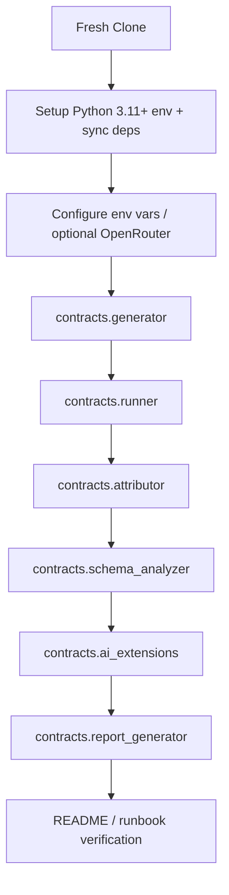
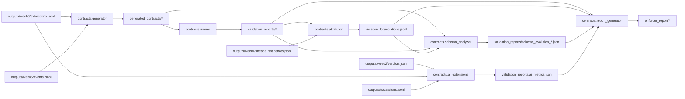
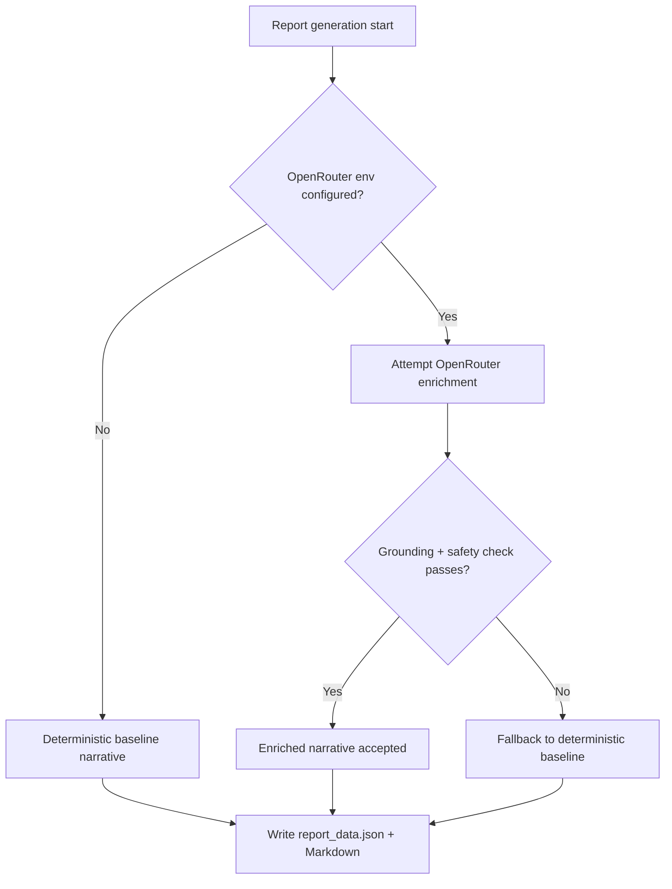

# Implementation Plan: Developer Workflow and End-to-End Runbook

**Branch**: `[008-create-feature-8]` | **Date**: 2026-04-05 | **Spec**: [spec.md](spec.md)
**Input**: Feature specification from `/specs/008-create-feature-8/spec.md`

## Summary

Feature 8 is a docs-first operational capability that turns the existing CLI platform into a reproducible, reviewer-friendly workflow. The implementation focus is on a canonical README quick-start, optional deep-dive runbooks, a placeholder-only `.env.example`, and a command-order guide that mirrors the real entry points already implemented in Features 1–7.

The baseline must remain deterministic without OpenRouter, while optional enrichment is documented as a safe add-on rather than a prerequisite. The architecture emphasizes quick verification for reviewers, deeper troubleshooting for maintainers, and explicit artifact-path mapping so users do not need to reverse engineer the repository.

## Technical Context

**Language/Version**: Python 3.11+

**Primary Dependencies**: `uv`, `pydantic>=2.6`, `PyYAML>=6.0`

**Storage**: File-based artifacts in canonical repository paths

**Testing**: Manual command walkthroughs and documentation checklist validation

**Target Platform**: Windows-first local development; shell-neutral docs

**Project Type**: Documentation/runbook for an existing Python CLI platform

**Performance Goals**: Fresh-clone readiness in under 30 minutes

**Constraints**: No secrets committed; `.env.example` placeholders only; OpenRouter optional; deterministic baseline; real CLI entry points only

**Scale/Scope**: Six CLI scripts, one README, one `.env.example`, and optional deep-dive runbooks

## Constitution Check

_GATE: Must pass before Phase 0 research. Re-check after Phase 1 design._

- [x] Spec-first gate: The active Feature 8 spec defines boundaries, clarifications, acceptance scenarios, and required vs optional behavior.
- [x] Canonical structure gate: The plan preserves the repository’s existing runtime layout and documents canonical paths rather than inventing new ones.
- [x] Compounding design gate: Deliverables are durable operational assets reused by reviewers, teammates, and future maintainers.
- [x] Data contract gate: Existing contract, validation, lineage, snapshot, and reporting paths are treated as first-class artifacts and referenced explicitly.
- [x] Evidence gate: The plan ties documentation to real CLI outputs and uses actual artifact families from Features 1–7.
- [x] Python production gate: The workflow assumes reproducible Python 3.11+ commands, deterministic file paths, and typed upstream tooling.
- [x] Downstream impact gate: Canonical paths, owners, and dependency order are documented so users understand blast radius and rerun expectations.
- [x] Operability gate: Outputs are described so they can be translated into plain-language operational guidance.
- [x] Prompt architecture gate: The feature framing builds on enduring platform capabilities, not checkpoint milestones.

## Project Structure

### Documentation (this feature)

```text
specs/008-create-feature-8/
├── plan.md              # This file (/speckit.plan output)
├── research.md          # Phase 0 output
├── data-model.md        # Phase 1 output
├── quickstart.md        # Phase 1 output
├── tasks.md             # Phase 2 output (/speckit.tasks)
└── checklists/
    ├── requirements.md  # Spec-quality checklist
    └── workflow.md      # Workflow/usability checklist
```

### Repository Artifacts Referenced by the Runbook

```text
README.md
.env.example
docs/runbooks/end_to_end.md            # optional, detailed maintainer flow
docs/runbooks/troubleshooting.md       # optional, failure matrix and reruns

contracts/generator.py
contracts/runner.py
contracts/attributor.py
contracts/schema_analyzer.py
contracts/ai_extensions.py
contracts/report_generator.py

generated_contracts/
validation_reports/
violation_log/
schema_snapshots/
outputs/
enforcer_report/
```

**Structure Decision**: This feature does not add new runtime code paths. It updates README and `.env.example`, and it may add optional deep-dive documentation under `docs/runbooks/` to keep the top-level README concise for reviewers.

## Architecture

### 1) Setup and Installation Guidance

- Canonical baseline: Python 3.11+.
- Canonical dependency sync: `uv sync --extra dev` against the repo’s `uv.lock`.
- Local environment creation: a project-local virtual environment managed by `uv` is preferred; fallback shell instructions can be described in troubleshooting only.
- First-run verification: confirm the interpreter version, then execute the first CLI command in the workflow rather than relying on a hidden bootstrap script.

### 2) Environment Configuration Guidance

- Core baseline requires no secrets and no mandatory OpenRouter values.
- `.env.example` is a placeholder-only template for environment variables.
- Optional OpenRouter variables: `OPENROUTER_API_KEY`, `OPENROUTER_BASE_URL`, `OPENROUTER_MODEL`.
- Configuration is loaded from the process environment; the runbook should explain that users may source a local `.env` or export variables in their shell, but the platform itself does not require secrets in the repository.

### 3) Command Sequencing Across Features

Canonical order:

1. `python -m contracts.generator`
2. `python -m contracts.runner`
3. `python -m contracts.attributor`
4. `python -m contracts.schema_analyzer`
5. `python -m contracts.ai_extensions`
6. `python -m contracts.report_generator`

Dependency rule: each step should be documented with its required inputs from earlier steps, its generated outputs, and whether it is required or conditional in the baseline workflow.

### 4) Expected Output Documentation

- Every command gets a concise output inventory in the README quick-start.
- Optional runbooks carry deeper examples, troubleshooting notes, and artifact index tables.
- Each output is documented with the exact canonical path or path pattern already established by Features 1–7.

### 5) Troubleshooting and Rerun Guidance

- Recovery starts with the earliest missing prerequisite, not the last failed command.
- Missing optional OpenRouter configuration is not an error; the runbook must describe it as a deterministic fallback to the baseline path.
- Partial execution recovery should always name the earliest upstream artifact to regenerate before rerunning dependent steps.

### 6) Reviewer-Oriented Quickstart Flow

- One-page path in README.
- Copy/paste setup commands.
- Canonical command order with short output inventory.
- Short note explaining that OpenRouter is optional and not required for a successful run.

### 7) Maintainer-Oriented Detailed Flow

- Optional `docs/runbooks/end_to_end.md` for the full command sequence, dependency map, and artifact index.
- Optional `docs/runbooks/troubleshooting.md` for failure cases, root causes, and rerun rules.
- README links to both deep-dive docs rather than duplicating their content.

## README Proposed Structure

1. Title and one-sentence mission statement
2. Quick-start checklist for reviewers
3. Environment setup and dependency sync
4. Canonical command sequence across Features 1–7
5. Expected outputs by step
6. Optional OpenRouter configuration
7. Troubleshooting pointer
8. Maintainer docs links and artifact index

## `.env.example` Contents

| Variable              | Required for baseline | Purpose                                     | Example value                  |
| --------------------- | --------------------: | ------------------------------------------- | ------------------------------ |
| `OPENROUTER_API_KEY`  |                    No | Auth for optional OpenRouter enrichment     | `your-api-key-here`            |
| `OPENROUTER_BASE_URL` |                    No | Endpoint for optional OpenRouter requests   | `https://openrouter.ai/api/v1` |
| `OPENROUTER_MODEL`    |                    No | Model name for optional OpenRouter requests | `openrouter/your-model`        |

Rules:

- Placeholders only.
- No secrets.
- No production credentials.
- Baseline operation does not depend on these values.

## Command Ordering and Dependency Mapping

| Step | Command                                | Required inputs                                                                                                   | Expected outputs                                                                                                                | Required? |
| ---- | -------------------------------------- | ----------------------------------------------------------------------------------------------------------------- | ------------------------------------------------------------------------------------------------------------------------------- | --------- |
| 1    | `python -m contracts.generator`        | `outputs/week3/extractions.jsonl`, `outputs/week5/events.jsonl`                                                   | `generated_contracts/week3_extractions.yaml`, `generated_contracts/week5_events.yaml`, DBT companion files                      | Required  |
| 2    | `python -m contracts.runner`           | Generated contracts from step 1                                                                                   | `validation_reports/*.json`, `schema_snapshots/baselines.json`                                                                  | Required  |
| 3    | `python -m contracts.attributor`       | Validation reports, lineage snapshots, ownership map, interface registry, generated contracts                     | `violation_log/violations.jsonl`                                                                                                | Required  |
| 4    | `python -m contracts.schema_analyzer`  | Generated contracts; enriched by validation and violation artifacts when available                                | `validation_reports/schema_evolution_*.json`, `migration_impact_*.json`, `validation_reports/schema_evolution_run_summary.json` | Required  |
| 5    | `python -m contracts.ai_extensions`    | `outputs/week2/verdicts.jsonl`, `outputs/week3/extractions.jsonl`, `outputs/traces/runs.jsonl`, contract metadata | `validation_reports/ai_metrics.json`, `violation_log/ai_violations.jsonl`, AI snapshots                                         | Required  |
| 6    | `python -m contracts.report_generator` | Validation reports, violations, schema evolution outputs, AI metrics, contract metadata                           | `enforcer_report/report_data.json`, `enforcer_report/report_{date}.md`                                                          | Required  |

## Expected Output Inventory by Step

- **Contract generation**: generated YAML contracts and DBT companion files in `generated_contracts/`.
- **Validation execution**: validation reports in `validation_reports/` plus refreshed baselines where applicable.
- **Violation attribution**: `violation_log/violations.jsonl`.
- **Schema evolution analysis**: `validation_reports/schema_evolution_*.json`, migration impact JSON, and run summary JSON.
- **AI contract enforcement**: `validation_reports/ai_metrics.json`, `violation_log/ai_violations.jsonl`, and AI snapshot files.
- **Report generation**: `enforcer_report/report_data.json` and `enforcer_report/report_{date}.md`.

## Risks and Mitigations

| Risk                                 | Impact                          | Mitigation                                                                                        |
| ------------------------------------ | ------------------------------- | ------------------------------------------------------------------------------------------------- |
| README becomes too long              | Reviewers miss the core flow    | Keep README as the quick-start index and move detail to optional runbooks                         |
| Command docs drift from real scripts | Users run stale workflows       | Tie every command to an actual `contracts/*.py` entry point and update docs with output paths     |
| OpenRouter is mistaken as required   | Baseline appears blocked        | Repeat that optional LLM enrichment is skipped safely when env vars are absent                    |
| Partial reruns are confusing         | Users rerun the wrong step      | Troubleshooting doc orders recovery from earliest missing prerequisite to latest dependent output |
| Artifact paths change silently       | Reviewers cannot locate outputs | Maintain a canonical artifact index in README and update it with every path change                |

## Mermaid Diagrams

### 1) End-to-End Execution Flow



### 2) Artifact Dependencies Across Scripts



### 3) Optional OpenRouter Branch vs Deterministic Baseline



## Design Notes

- The feature is documentation-only; no new runtime source modules are introduced.
- Optional runbooks are intentionally separated from the README so first-time users can verify the platform quickly.
- Any future command, path, or environment change must update README and `.env.example` together.
