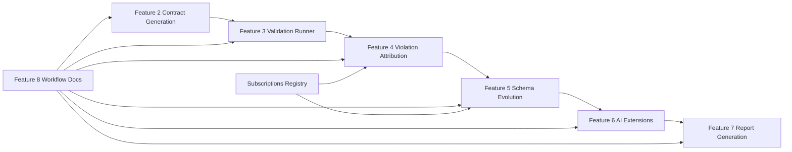
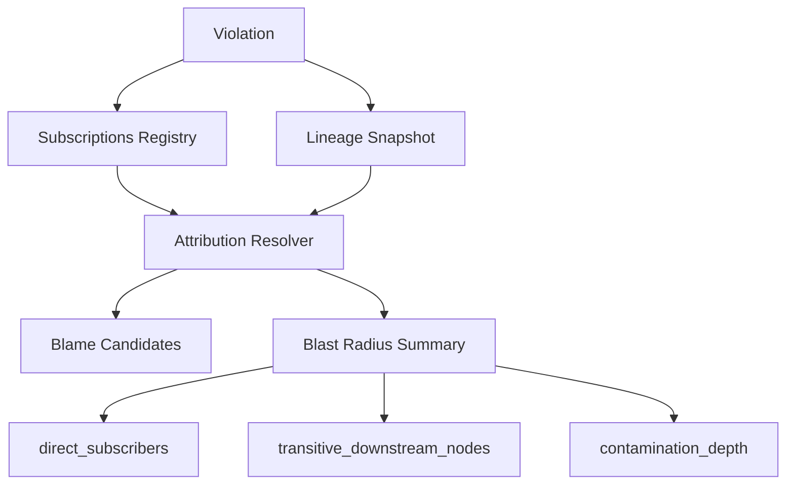
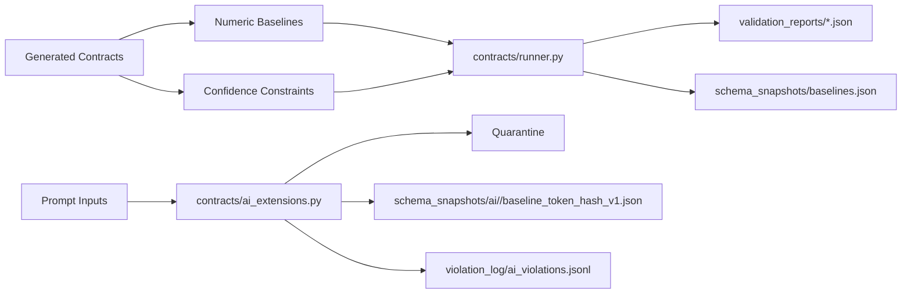

# Implementation Plan: Spec Alignment and Platform Completion

**Branch**: `009-spec-alignment` | **Date**: 2026-04-05 | **Spec**: [spec.md](spec.md)
**Input**: Feature specification from `/specs/009-spec-alignment/spec.md`

## Summary

Deliver a production-grade Python update that closes the remaining platform-alignment gaps across contract generation, validation, attribution, schema evolution, AI extensions, and reporting while introducing a first-class subscriptions registry as the authoritative subscription-topology artifact. The implementation extends existing Feature 2–8 outputs, preserves deterministic baseline behavior, and uses OpenRouter only for optional LLM-assisted annotations and narrative enrichment.

**Language/Version**: Python 3.11+
**Primary Dependencies**: Existing `contracts/*.py` modules, YAML/JSON file handling, environment-based OpenRouter integration
**Storage**: Repository files under `docs/governance/`, `schema_snapshots/`, `validation_reports/`, `violation_log/`, `generated_contracts/`, `outputs/`
**Testing**: Existing repo validation paths and documentation review; no new runtime test harness is required for this planning phase
**Target Platform**: Cross-platform local developer environment on Windows/macOS/Linux
**Project Type**: Python CLI/data-contract platform
**Performance Goals**: Deterministic baseline execution; bounded attribution candidate ranking; report generation remains non-blocking under optional LLM enrichment
**Constraints**: Preserve canonical repository structure; OpenRouter is the only optional LLM provider; all LLM config must come from environment variables; no fabricated operational outputs
**Scale/Scope**: Platform-wide update spanning Features 2–8 with one new governed registry artifact

## Constitution Check

_GATE: Must pass before Phase 0 research. Re-check after Phase 1 design._

- [x] Spec-first gate: Active spec exists and defines behavior, boundaries, and acceptance scenarios before implementation work.
- [x] Canonical structure gate: Plan uses challenge-required canonical repository layout, or explicitly documents approved deviations.
- [x] Compounding design gate: Deliverables are durable assets reusable by later features; no isolated throwaway artifacts.
- [x] Data contract gate: Schemas, clauses, lineage mappings, validation outputs, and violation records are treated as first-class artifacts with stable paths.
- [x] Evidence gate: Plan defines how mismatch evidence, validation runs, and operational reports are generated from real or explicitly injected test data.
- [x] Python production gate: Module boundaries, typed structures where appropriate, deterministic paths, and reproducible CLI commands are defined.
- [x] Downstream impact gate: Schema/interface changes capture owners, dependents, blast radius, and migration expectations.
- [x] Operability gate: Outputs are structured for translation into plain-language operational guidance.
- [x] Prompt architecture gate: Feature framing builds on approved specs and enduring platform capabilities, not temporary checkpoint framing.

## Project Structure

### Documentation (this feature)

```text
specs/009-spec-alignment/
├── plan.md              # This file (/speckit.plan command output)
├── research.md          # Phase 0 output
├── data-model.md        # Phase 1 output
├── quickstart.md        # Phase 1 output
├── tasks.md             # Phase 2 output (/speckit.tasks command - not created by /speckit.plan)
└── checklists/
      └── requirements.md  # Spec validation checklist
```

### Source Code (repository root)

```text
contracts/
├── generator.py
├── runner.py
├── attributor.py
├── schema_analyzer.py
├── ai_extensions.py
└── report_generator.py

docs/governance/
└── subscriptions_registry.yaml

schema_snapshots/
├── baselines.json
└── ai/

validation_reports/

violation_log/

generated_contracts/

outputs/week4/
└── lineage_snapshots.jsonl

README.md
.env.example
docs/runbooks/end_to_end.md
docs/runbooks/troubleshooting.md
```

**Structure Decision**: Preserve the canonical repository layout already established by earlier features. Add one governance artifact at `docs/governance/subscriptions_registry.yaml`; all other changes extend existing platform directories and CLI entry points.

## Phase 1 Re-check

No constitution violations remain after Phase 1 design. The update preserves canonical structure, compounding delivery, data-contract-first artifacts, real evidence generation, downstream impact tracking, and Python production conventions.

## Architecture Overview

### Phase 0: Research and Clarification

- Confirm canonical registry path and YAML schema.
- Validate numeric baseline and embedding baseline artifact formats.
- Resolve mode semantics and scoring formulas into implementation-ready definitions.
- Capture deterministic fallback rules for every optional LLM-assisted path.

### Phase 1: Design and Artifact Modeling

- Define the subscriptions registry data model and its required minimum interface set.
- Define numeric drift and embedding drift baseline artifacts.
- Define validation mode behavior, blast radius structure, and migration impact outputs.
- Define AI prompt/output validation surfaces and report-action extraction rules.

### Phase 2: Implementation Alignment

- Update `contracts/generator.py` to emit numeric baselines, confidence bounds, and lineage-derived consumers.
- Update `contracts/runner.py` to load baselines, apply drift thresholds, and support AUDIT/WARN/ENFORCE.
- Update `contracts/attributor.py` to consult the registry, compute confidence, and emit structured blast radius.
- Update `contracts/schema_analyzer.py` to classify the float-to-int narrowing rule and consumer-specific failure modes.
- Update `contracts/ai_extensions.py` to validate prompt inputs, track output violations, and record embedding drift.
- Update `contracts/report_generator.py` to compute health score, derive actions, and preserve deterministic narrative output.

### Phase 3: Documentation and Workflow

- Update `README.md` with the registry-aware quick-start and operational index.
- Update `.env.example` to document OpenRouter-only optional environment variables.
- Update runbooks to explain registry integration, validation modes, and fallback behavior.

## Data and Artifact Plan

### Subscriptions Registry

- Canonical path: `docs/governance/subscriptions_registry.yaml`
- Schema: top-level `version`, `generated_at`, `interfaces`
- Entry requirements: `interface_id`, `producer`, `consumer`, `schema_name` or `record_type`, `criticality`, and `dependency_type` or `directness`
- Consumption: attribution, blast radius, and schema evolution use the registry before or alongside lineage traversal

### Numeric Drift Baseline Artifact

- Canonical path: `schema_snapshots/baselines.json`
- Format: JSON object keyed by contract or surface identifier and field name
- Required fields: sample count, mean, standard deviation, and distribution summary sufficient for stddev-based drift
- Generated by: `contracts/generator.py`, consumed by `contracts/runner.py`

### Embedding Drift Baseline Artifact

- Canonical path: `schema_snapshots/ai/<surface_id>/baseline_token_hash_v1.json`
- Format: JSON centroid artifact with token-hash baseline and centroid metadata
- Generated by: `contracts/ai_extensions.py`, consumed by the same module during cosine-distance checks

### Validation Mode Model

- `AUDIT`: execute all checks, build full report, record threshold outcomes, do not escalate thresholds into failures
- `WARN`: execute all checks, build full report, emit WARN for threshold breaches, preserve structured ERROR results
- `ENFORCE`: execute all checks, build full report, escalate threshold breaches to FAIL, preserve structured ERROR results

### Blast Radius Model

- Required fields: `affected_nodes`, `affected_pipelines`, `direct_subscribers`, `transitive_downstream_nodes`, `contamination_depth`
- `direct_subscribers`: first-hop registry subscribers
- `transitive_downstream_nodes`: all registry descendants beyond the first hop
- `contamination_depth`: maximum hop distance from the violating node to any affected downstream node

### Migration Impact Model Additions

- Name downstream consumers explicitly
- Record likely failure modes per consumer
- Record rollback steps
- Record baseline re-establishment requirements
- Surface severity and urgency for the float 0.0–1.0 → int 0–100 CRITICAL rule

### AI Metric and WARN Threshold Model

- Governed prompt inputs validated against JSON Schema before model invocation
- Structured output schema violations counted as a rate per run and per governed surface
- Output violation threshold exceedance writes WARN to `violation_log/ai_violations.jsonl`
- Invalid prompt inputs are quarantined before they can affect the baseline path

### Report Action Extraction Model

- Source evidence: top validation violation, top schema change, AI metric breach, or attribution evidence
- Required references: file path, field, contract clause
- Prioritization: highest severity first, then lowest remediation effort, then strongest evidence
- Optional narrative enrichment may explain but must not alter the deterministic action list

## Deterministic Behavior Rules

- If OpenRouter is absent, the platform uses deterministic non-LLM paths everywhere.
- Optional annotations and narratives are additive only; they never change core outcomes.
- Missing registry, missing baselines, missing lineage, or missing OpenRouter config must degrade gracefully and preserve structured evidence.
- Report generation always completes even when optional enrichment is unavailable.

## Risks and Mitigations

| Risk                               | Impact                                | Mitigation                                                                            |
| ---------------------------------- | ------------------------------------- | ------------------------------------------------------------------------------------- |
| Registry drift from lineage        | Incorrect downstream consumer mapping | Make the registry authoritative and cross-check lineage only as supporting evidence   |
| Ambiguous baseline format          | Incorrect drift calculations          | Standardize JSON artifact shapes and document them in research/data-model files       |
| Overlapping WARN/FAIL semantics    | Inconsistent validation results       | Use strict threshold definitions and keep confidence checks separate                  |
| Optional LLM leakage into defaults | Non-deterministic behavior            | Keep OpenRouter environment-driven and fallback deterministic by default              |
| Report action vagueness            | Unclear remediation guidance          | Require file path, field, and contract clause references from the triggering evidence |

## Mermaid Diagrams

### 1) Unified Update Architecture Across Features 2–8



### 2) Subscriptions Registry Integration into Attribution and Blast Radius



### 3) Baseline-Driven Validation and AI Drift Flows



### 4) Report Evidence Flow from Violations, Schema Changes, and AI Metrics into Final Actions

```mermaid
flowchart TD
      VR[validation_reports/*.json] --> RG[contracts/report_generator.py]
      VL[violation_log/violations.jsonl] --> RG
      SV[validation_reports/schema_evolution_*.json] --> RG
      AM[validation_reports/ai_metrics.json] --> RG
      RG --> D[data_health_score]
      RG --> RA[ranked report actions]
      RG --> RP[enforcer_report/report_data.json]
      RG --> MD[enforcer_report/report_{date}.md]
```
